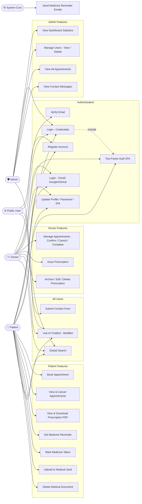
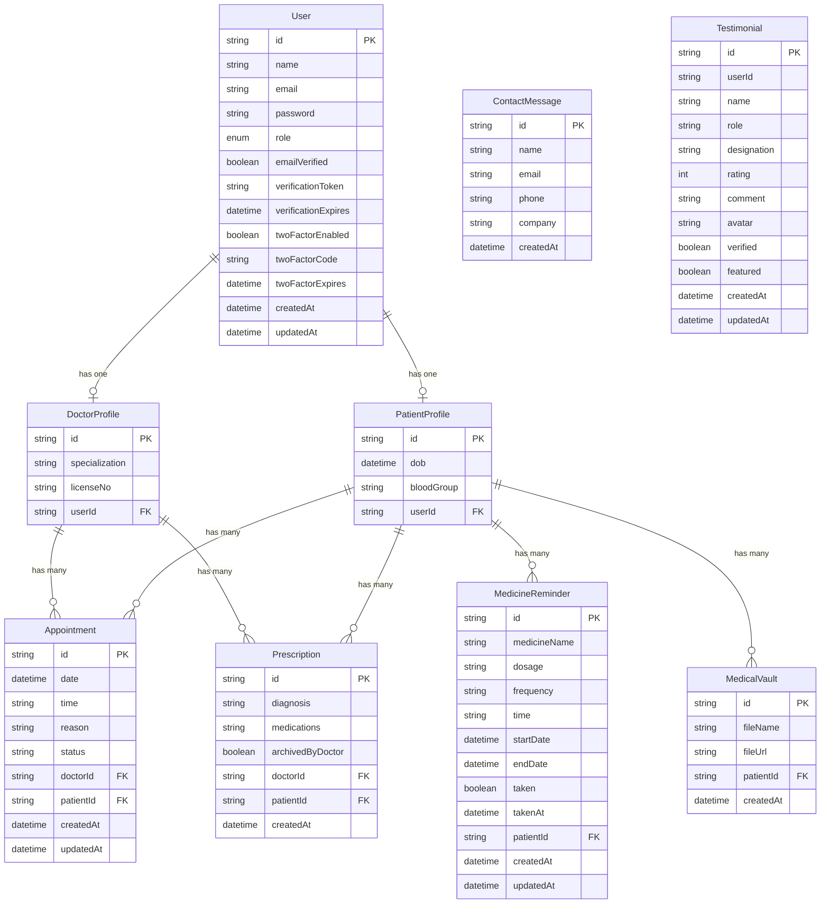
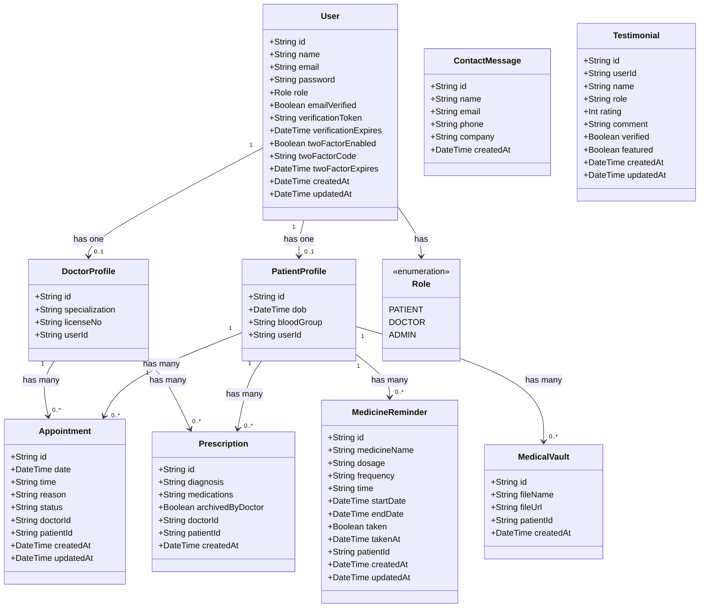

# CSE 414 — Software Engineering Lab
# Final Project Report

**Project Title:** MediScript-E — A Secure Digital Healthcare Platform
**Developer:** Tushar Barua
**Department:** Computer Science & Engineering
**University:** University of Science and Technology Chittagong (USTC)
**Session:** 2024–2025
**Live URL:** https://mediscript-e.vercel.app
**GitHub:** https://github.com/tusharsno/mediscript-e

---

## Table of Contents

1. Lab Session 1 — Software Engineering Fundamentals & Project Initiation
2. Lab Session 2 — Software Process Models & Development Strategy
3. Lab Session 3 — Requirements Engineering & Analysis
4. Lab Session 4 — Software Requirement Specification (SRS)
5. Lab Session 5 — Use Case Modeling & System Behavior
6. Lab Session 6 — System Design & UML Modeling
7. Lab Session 7 — Reliability, Dependability & Security Engineering
8. Lab Session 8 — Verification, Validation & Software Testing
9. Lab Session 9 — Coding, Implementation & Version Control
10. Lab Session 10 — Maintenance, Ethics & Final Review

---

---

# LAB SESSION 1
## Lab Name: Software Engineering Fundamentals & Project Initiation
## Project: MediScript-E — Digital Healthcare Platform

---

## Objectives
- Understand the scope and importance of software engineering
- Identify a real-world problem suitable for a software solution
- Define project vision, stakeholders, and system boundaries

---

## Theory

Software Engineering is the application of engineering principles to software development to ensure that systems are reliable, maintainable, scalable, and cost-effective.

Unlike small programs, large software systems involve:
- Multiple stakeholders with different needs
- Long-term maintenance and evolution
- High risk and complexity
- Critical documentation at every phase

This lab introduces:
- Software crisis and the need for engineering discipline
- Characteristics of good software (correctness, reliability, usability, maintainability)
- Difference between software engineering and ad-hoc programming
- Importance of documentation throughout the SDLC

---

## Task 1: Project Title & Problem Statement

### Project Title
**MediScript-E — A Secure Digital Healthcare Platform**

### Problem Statement
Traditional healthcare management in Bangladesh and similar developing regions suffers from critical inefficiencies:

- Patients carry **physical prescriptions** that are easily lost or damaged
- **No centralized system** exists to store and access medical records securely
- Appointment booking requires **phone calls or physical hospital visits**, causing delays
- Doctors lack a **digital tool** to manage patient appointments and issue prescriptions efficiently
- Medicine schedules are frequently **forgotten** with no automated reminder system
- Medical reports are **scattered across multiple hospitals and clinics**, making history tracking impossible
- There is **no role-based access control** to ensure sensitive health data is accessed only by authorized parties

These problems result in poor patient outcomes, inefficient doctor workflows, and insecure medical data management.

---

## Task 2: Stakeholder List

| Stakeholder | Role | Interest in System |
|-------------|------|--------------------|
| Patient | Primary User | Book appointments, view prescriptions, manage health records, receive medicine reminders |
| Doctor | Primary User | Manage appointments, issue digital prescriptions, view patient information |
| Administrator | Primary User | Monitor platform statistics, manage users, oversee all appointments |
| Developer (Tushar Barua) | System Developer | Design, implement, test, and deploy the system |
| University (USTC) | Academic Stakeholder | Evaluate the project as part of Software Engineering Lab |
| Email Service (Gmail SMTP) | External Service | Deliver verification emails, OTPs, and medicine reminders |
| OAuth Providers (Google, GitHub) | External Service | Provide third-party authentication |
| Supabase | Infrastructure Provider | Host PostgreSQL database and file storage |
| Vercel | Infrastructure Provider | Host and deploy the web application |
| Groq AI | External Service | Power the AI chatbot (MediBot) |

---

## Task 3: System Scope Definition

### In-Scope Features

| Feature | Description |
|---------|-------------|
| User Registration & Authentication | Email/password registration, email verification, OAuth login (Google, GitHub), 2FA |
| Appointment Management | Patients book appointments; doctors confirm, cancel, complete |
| Digital Prescriptions | Doctors issue prescriptions; patients view and download as PDF |
| Medicine Reminders | Patients set schedules; automated email alerts via cron job |
| Medical Vault | Patients upload and manage medical documents securely |
| Admin Dashboard | Real-time statistics, user management, appointment monitoring |
| AI Chatbot (MediBot) | Platform assistance powered by Groq Llama 3.1 |
| Global Search | Role-aware search across appointments, prescriptions, users |
| Settings | Profile update, password change, 2FA toggle |

### Out-of-Scope Features

| Feature | Reason |
|---------|--------|
| Video consultations | Requires WebRTC infrastructure — planned for future |
| Payment gateway / billing | Telemedicine payments — planned for future |
| Mobile application | React Native app — planned for future |
| HIPAA / GDPR compliance certification | Regulatory process — long-term goal |
| Automated test suite (Jest) | Manual testing used for this version |
| AI symptom checker | Requires medical training data — planned for future |
| Prescription QR code for pharmacy | Pharmacy integration — planned for future |

---

## Key Findings / Learning Outcomes
- Successfully identified a real-world healthcare problem with clear pain points
- Defined **10 stakeholders** spanning users, developers, and external services
- Established clear system boundaries — 9 in-scope features and 7 out-of-scope items
- Understood that proper project initiation prevents scope creep during development
- Recognized that healthcare software requires extra attention to security and privacy from the very beginning


---

# LAB SESSION 2
## Lab Name: Software Process Models & Development Strategy
## Project: MediScript-E — Digital Healthcare Platform

---

## Objectives
- Understand different SDLC models and their characteristics
- Select an appropriate process model for MediScript-E
- Justify the process model selection based on project characteristics

---

## Theory

The Software Development Life Cycle (SDLC) defines the structured process followed to develop a software system. Different SDLC models are suited to different project types.

### Common SDLC Models

| Model | Approach | Best For | Weakness |
|-------|----------|----------|----------|
| Waterfall | Sequential, phase-by-phase | Fixed requirements, clear scope | Inflexible, no feedback until late |
| Agile | Iterative, sprint-based | Evolving requirements, team collaboration | Requires constant client involvement |
| Incremental | Build in increments, each adds functionality | Medium complexity, growing features | Integration challenges across increments |
| Spiral | Risk-driven, iterative with risk analysis | High-risk projects | Complex, expensive |
| V-Model | Testing parallel to development phases | Safety-critical systems | Rigid, no flexibility |
| RAD | Rapid prototyping | UI-heavy, short timeline | Not suitable for complex systems |

---

## Task 1: SDLC Model Selection

### Selected Model: **Incremental Development Model**

MediScript-E was developed using the **Incremental Development Model**, where the system was built and delivered in increments. Each increment added a complete, functional module to the system.

### Development Increments for MediScript-E

| Increment | Features Added | Status |
|-----------|---------------|--------|
| Increment 1 | User registration, email verification, credential login | ✅ Complete |
| Increment 2 | OAuth login (Google, GitHub), 2FA via email OTP | ✅ Complete |
| Increment 3 | Appointment booking and management (Patient + Doctor) | ✅ Complete |
| Increment 4 | Digital prescriptions — issue, view, PDF download | ✅ Complete |
| Increment 5 | Medicine reminders with automated email alerts (cron) | ✅ Complete |
| Increment 6 | Medical vault — file upload and management | ✅ Complete |
| Increment 7 | Admin dashboard — statistics, user and appointment management | ✅ Complete |
| Increment 8 | AI chatbot (MediBot) powered by Groq Llama 3.1 | ✅ Complete |
| Increment 9 | Global search, notifications, settings, OAuth profile pictures | ✅ Complete |
| Increment 10 | UI polish — page transitions, responsive design, dedicated routes | ✅ Complete |

---

## Task 2: Justification for Model Selection

| Criterion | Justification |
|-----------|---------------|
| **Evolving requirements** | New features (AI chatbot, global search, profile pictures) were identified during development — Incremental model accommodates this naturally |
| **Single developer** | Incremental model is well-suited for individual developers who build and test one module at a time |
| **Early working software** | Each increment produced working, testable software — authentication worked before prescription was built |
| **Risk management** | High-risk features (2FA, OAuth, AI integration) were built as separate increments, isolating failure impact |
| **Continuous deployment** | Each increment was deployed to Vercel independently — users could access the live system throughout development |
| **Clear module boundaries** | MediScript-E has well-defined modules (Auth, Appointments, Prescriptions, etc.) — each maps naturally to an increment |

---

## Task 3: Comparison with Alternative Models

### Why Not Waterfall?
Waterfall requires all requirements to be defined upfront and does not allow revisiting earlier phases. MediScript-E requirements evolved during development — new features like AI chatbot and global search were added after the initial plan. Waterfall would have required restarting design phases.

### Why Not Pure Agile?
Agile requires sprint planning, daily standups, and constant stakeholder feedback in a team environment. As a single-developer project, formal Agile ceremonies are impractical. However, Agile **principles** (iterative delivery, continuous improvement) are followed through the Incremental model.

### Why Not Spiral?
Spiral model is designed for large-scale, high-risk commercial projects requiring formal risk analysis at every cycle. MediScript-E is a medium-scale academic project — Spiral's complexity and overhead are unnecessary.

---

## Task 4: Development Strategy

### Technology Selection Rationale

| Decision | Rationale |
|----------|-----------|
| **Next.js 16** | Full-stack framework — combines frontend and API in one codebase, simplifying deployment |
| **TypeScript** | Static typing prevents runtime errors, improves maintainability |
| **PostgreSQL (Supabase)** | Managed relational database — reliable, scalable, free tier available |
| **Prisma ORM** | Type-safe database queries, automatic migration management |
| **NextAuth.js** | Battle-tested authentication library — supports credentials, OAuth, JWT out of the box |
| **Vercel** | Zero-configuration deployment for Next.js — CI/CD from GitHub push |
| **Groq SDK** | Fast, free-tier AI inference for LLM chatbot integration |
| **Nodemailer** | Gmail SMTP integration for email verification, OTP, and reminders |

### Development Environment

| Tool | Purpose |
|------|---------|
| VS Code | Primary code editor |
| pnpm | Fast, efficient package manager |
| Git + GitHub | Version control and repository hosting |
| Vercel CLI | Manual production deployments |
| Prisma Studio | Database browsing and management |
| Postman / Browser | API testing |

### Version Control Strategy

| Branch | Purpose |
|--------|---------|
| `main` | Production branch — deployed to Vercel |
| Local development | Feature development before pushing to `main` |

All commits pushed directly to `main` with meaningful commit messages. Each increment corresponds to a set of related commits.

---

## Key Findings / Learning Outcomes
- Understood that **no single SDLC model fits all projects** — model selection depends on project size, team, and requirements stability
- Learned that the **Incremental model** is most appropriate for MediScript-E because it supports evolving requirements, single-developer workflow, and continuous deployment
- Justified technology stack choices based on project requirements, not just popularity
- Recognized that Agile principles can be applied informally even without formal Agile ceremonies
- Understood that **early working software** is a key advantage of Incremental development — each module was functional before the next was started


---

# LAB SESSION 3
## Lab Name: Requirements Engineering & Analysis
## Project: MediScript-E — Digital Healthcare Platform

---

## Objectives
- Identify functional and non-functional requirements of MediScript-E
- Apply requirement elicitation techniques
- Prioritize requirements based on system criticality

---

## Theory
Requirements Engineering ensures that the right system is built. For MediScript-E, a digital healthcare platform, accurate requirements are critical because they directly impact patient safety and data security.

**Types of Requirements:**
- **Functional Requirements (FR):** What the system does — e.g., booking appointments, issuing prescriptions
- **Non-Functional Requirements (NFR):** How the system performs — e.g., response time, security, availability

Poor requirements are the leading cause of project failure. In healthcare systems, incomplete requirements can lead to data breaches or incorrect medical records.

---

## Task 1: Functional Requirement List

| FR ID | Functional Requirement | Actor |
|-------|----------------------|-------|
| FR-01 | System shall allow users to register as PATIENT, DOCTOR, or ADMIN | All Users |
| FR-02 | System shall send email verification link upon registration | All Users |
| FR-03 | System shall allow verified users to login with email and password | All Users |
| FR-04 | System shall support OAuth login via Google and GitHub with profile picture | All Users |
| FR-05 | System shall enforce Two-Factor Authentication (2FA) via email OTP when enabled | Patient, Doctor |
| FR-06 | System shall allow patients to book appointments with available doctors | Patient |
| FR-07 | System shall allow doctors to confirm, cancel, or complete appointments | Doctor |
| FR-08 | System shall allow doctors to issue digital prescriptions with diagnosis and medications | Doctor |
| FR-09 | System shall allow patients to view and download prescriptions as PDF | Patient |
| FR-10 | System shall allow patients to set medicine reminders with automated email alerts | Patient |
| FR-11 | System shall allow patients to upload and store medical reports (Medical Vault) | Patient |
| FR-12 | System shall allow patients to delete uploaded medical reports | Patient |
| FR-13 | System shall allow users to update profile name and password | All Users |
| FR-14 | System shall allow users to enable or disable 2FA from settings | Patient, Doctor |
| FR-15 | System shall allow admin to view real-time dashboard statistics | Admin |
| FR-16 | System shall allow admin to view and delete users (except self) | Admin |
| FR-17 | System shall allow admin to monitor all appointments with status filters | Admin |
| FR-18 | System shall allow admin to view all contact form submissions | Admin |
| FR-19 | System shall allow unauthenticated users to submit contact form | Public |
| FR-20 | System shall send automated medicine reminder emails via cron job | System |
| FR-21 | System shall allow doctors to archive and unarchive issued prescriptions | Doctor |
| FR-22 | System shall allow doctors to edit and delete issued prescriptions | Doctor |
| FR-23 | System shall provide an AI-powered chatbot (MediBot) for platform-related queries | All Users |
| FR-24 | System shall provide a global search feature across appointments, prescriptions, and users | All Users |
| FR-25 | System shall display OAuth profile pictures in navbar and dashboard sidebar | All Users |
| FR-26 | System shall provide separate dedicated pages for each major feature | All Users |
| FR-27 | System shall provide smooth page transition animations in dashboard | All Users |

---

## Task 2: Non-Functional Requirement List

| NFR ID | Non-Functional Requirement | Category |
|--------|--------------------------|----------|
| NFR-01 | System shall load pages within 3 seconds under normal load | Performance |
| NFR-02 | System shall maintain 99.9% uptime in production | Availability |
| NFR-03 | All passwords shall be hashed using bcryptjs before storage | Security |
| NFR-04 | All database connections shall use SSL/TLS encryption | Security |
| NFR-05 | JWT-based sessions shall expire after 30 days of inactivity | Security |
| NFR-06 | Email verification tokens shall expire within 24 hours | Security |
| NFR-07 | 2FA OTP codes shall expire within 10 minutes | Security |
| NFR-08 | System shall support role-based access control (RBAC) for all API routes | Security |
| NFR-09 | Medical file uploads shall be restricted to valid file types and size limits | Security |
| NFR-10 | System shall be fully responsive across mobile, tablet, and desktop | Usability |
| NFR-11 | System UI shall provide clear feedback for all user actions | Usability |
| NFR-12 | System shall use PostgreSQL (Supabase) as production-grade database | Reliability |
| NFR-13 | System codebase shall follow TypeScript strict typing standards | Maintainability |
| NFR-14 | System shall be deployable on Vercel with zero-downtime deployments | Scalability |
| NFR-15 | All API routes shall validate input before processing | Security |
| NFR-16 | AI chatbot shall respond in the user's language with plain conversational text (English by default, Bangla if user writes in Bangla) | Usability |
| NFR-17 | Search results shall be role-based — users only see their own relevant data | Security |
| NFR-18 | Dashboard navigation shall use dedicated routes for each feature section | Usability |

---

## Task 3: Priority Matrix

| Requirement ID | Description | Priority | Justification |
|---------------|-------------|----------|---------------|
| FR-01 | User Registration | High | Core entry point of the system |
| FR-02 | Email Verification | High | Prevents fake registrations |
| FR-03 | Credential Login | High | Primary authentication method |
| FR-04 | OAuth Login with Profile Picture | Medium | Convenience + professional UX |
| FR-05 | 2FA via Email OTP | High | Critical security layer |
| FR-06 | Book Appointment | High | Core patient functionality |
| FR-07 | Manage Appointments | High | Core doctor functionality |
| FR-08 | Issue Prescription | High | Core doctor functionality |
| FR-09 | View/Download Prescription | High | Core patient functionality |
| FR-10 | Medicine Reminders | Medium | Value-added patient feature |
| FR-11 | Medical Vault Upload | Medium | Value-added patient feature |
| FR-12 | Delete Medical Report | Low | Supporting feature |
| FR-13 | Profile/Password Update | Medium | Standard account management |
| FR-14 | 2FA Toggle in Settings | Medium | User preference feature |
| FR-15 | Admin Dashboard Stats | High | Critical admin oversight |
| FR-16 | Admin User Management | High | Critical admin control |
| FR-17 | Admin Appointment Monitor | Medium | Admin oversight feature |
| FR-18 | Admin Contact Messages | Low | Supporting admin feature |
| FR-19 | Contact Form | Low | Public communication feature |
| FR-20 | Automated Reminders (Cron) | Medium | Automated system feature |
| FR-21 | Prescription Archive | Medium | Doctor workflow management |
| FR-22 | Prescription Edit/Delete | Medium | Doctor data management |
| FR-23 | AI Chatbot (MediBot) | Medium | User assistance feature |
| FR-24 | Global Search | Medium | Navigation efficiency |
| FR-25 | OAuth Profile Pictures | Low | Professional UX enhancement |
| FR-26 | Dedicated Feature Pages | High | Professional app structure |
| FR-27 | Page Transition Animations | Low | Premium UX feel |
| NFR-01 | Page Load Performance | High | Directly impacts user experience |
| NFR-03 | Password Hashing | High | Critical security requirement |
| NFR-04 | SSL/TLS Database | High | Critical data protection |
| NFR-08 | RBAC on APIs | High | Prevents unauthorized access |
| NFR-10 | Responsive Design | High | Multi-device accessibility |

---

## Key Findings / Learning Outcomes
- Successfully identified **27 Functional Requirements** and **18 Non-Functional Requirements** for MediScript-E as an initial requirements baseline
- These requirements were further expanded to **59 Functional Requirements** across 7 modules in the full SRS document (Lab Session 4)
- Learned to categorize requirements by actor (Patient, Doctor, Admin, Public, System)
- Understood that in healthcare systems, security-related NFRs carry equal or higher priority than functional requirements
- Priority matrix helps development team focus on critical features first, ensuring MVP delivery
- New features (AI Chatbot, Search, Prescription Archive, Profile Pictures, Dedicated Pages) were added based on professional web app standards


---

# LAB SESSION 4
## Lab Name: Software Requirement Specification (SRS)
## Project: MediScript-E — Digital Healthcare Platform

---

## Objectives
- Prepare a formal IEEE-standard SRS document for MediScript-E
- Learn requirement documentation best practices
- Establish a contract between stakeholders and developers

---

## Theory
The SRS document acts as:
- **A Contract:** Agreement between stakeholders and development team
- **A Design Reference:** Blueprint for system architecture and implementation
- **A Testing Baseline:** Foundation for test case design and validation

A good SRS must be **complete**, **unambiguous**, and **verifiable**. For MediScript-E, the SRS ensures all healthcare workflows are properly documented before implementation.

---

## Software Requirement Specification Document

---

### 1. Introduction

#### 1.1 Purpose
This SRS document defines the functional and non-functional requirements for **MediScript-E**, a digital healthcare platform. It serves as a reference for developers, testers, and stakeholders throughout the software development lifecycle.

#### 1.2 Scope
MediScript-E is a web-based healthcare platform that enables:
- Patients to book appointments, manage prescriptions, set medicine reminders, and store medical records
- Doctors to manage appointments, issue digital prescriptions, and archive/edit prescriptions
- Administrators to monitor platform activity and manage users
- All users to interact with an AI-powered chatbot (MediBot) for platform assistance
- All authenticated users to use a global search feature

The system is built using **Next.js 16**, **PostgreSQL (Supabase)**, **Prisma ORM**, **Groq AI SDK**, and deployed on **Vercel**.

#### 1.3 Definitions, Acronyms, and Abbreviations

| Term | Definition |
|------|-----------|
| SRS | Software Requirement Specification |
| FR | Functional Requirement |
| NFR | Non-Functional Requirement |
| RBAC | Role-Based Access Control |
| OTP | One-Time Password |
| 2FA | Two-Factor Authentication |
| JWT | JSON Web Token |
| API | Application Programming Interface |
| PDF | Portable Document Format |
| OAuth | Open Authorization |
| AI | Artificial Intelligence |
| LLM | Large Language Model |

#### 1.4 References
- Next.js 16 Documentation: https://nextjs.org
- Prisma ORM Documentation: https://prisma.io
- Supabase Documentation: https://supabase.com
- NextAuth.js Documentation: https://next-auth.js.org
- Groq API Documentation: https://console.groq.com
- IEEE Std 830-1998: IEEE Recommended Practice for SRS

#### 1.5 Overview
This document is organized as follows:
- Section 2: Overall system description
- Section 3: Functional requirements
- Section 4: Non-functional requirements
- Section 5: Constraints and assumptions

---

### 2. Overall Description

#### 2.1 Product Perspective
MediScript-E is a standalone web application that integrates with:
- **Supabase** for PostgreSQL database and file storage
- **Google & GitHub OAuth** for third-party authentication with profile pictures
- **Gmail SMTP (Nodemailer)** for email notifications
- **Groq AI API** for AI chatbot (MediBot) powered by Llama 3.1
- **Vercel** for cloud deployment

#### 2.2 Product Functions
The system provides the following major functions:
1. User authentication and authorization (email/password, OAuth, 2FA)
2. Appointment booking and management with dedicated pages
3. Digital prescription issuance, PDF download, archive, and edit
4. Medicine reminder scheduling with email alerts
5. Medical vault for secure document storage
6. Admin dashboard with real-time statistics
7. AI-powered chatbot (MediBot) for platform assistance
8. Global search across appointments, prescriptions, and users
9. Profile picture display from OAuth providers

#### 2.3 User Classes and Characteristics

| User Class | Description | Technical Level |
|-----------|-------------|-----------------|
| Patient | Registers, books appointments, manages health records | Low to Medium |
| Doctor | Manages appointments, issues and archives prescriptions | Medium |
| Admin | Monitors platform, manages users | High |
| Public | Views landing page, submits contact form, uses chatbot | Low |

#### 2.4 Operating Environment
- **Client:** Modern web browsers (Chrome, Firefox, Safari, Edge)
- **Server:** Vercel Serverless Functions (Node.js runtime)
- **Database:** PostgreSQL hosted on Supabase
- **Storage:** Supabase Storage for medical documents
- **AI:** Groq API (Llama 3.1 8B Instant model)

#### 2.5 Design and Implementation Constraints
- Must use Next.js App Router architecture with dedicated routes per feature
- Must use Prisma ORM for all database operations
- Must comply with Vercel serverless function limitations
- File uploads limited to supported medical document formats
- AI chatbot must only answer platform-related questions

#### 2.6 Assumptions and Dependencies
- Users have access to a valid email address
- Users have a stable internet connection
- Supabase services remain available
- Gmail SMTP credentials remain valid for email delivery
- Groq API key remains valid for AI chatbot responses

---

### 3. Functional Requirements

#### 3.1 Authentication Module

| FR ID | Requirement | Priority |
|-------|-------------|----------|
| FR-01 | System shall allow users to register with name, email, password, and role (PATIENT/DOCTOR) | High |
| FR-02 | System shall send an email verification link upon successful registration | High |
| FR-03 | System shall prevent login until email is verified | High |
| FR-04 | System shall allow verified users to login with email and password | High |
| FR-05 | System shall support OAuth login via Google and GitHub | Medium |
| FR-06 | System shall auto-verify OAuth users and create a patient profile | Medium |
| FR-07 | System shall display OAuth profile pictures in navbar and dashboard sidebar | Medium |
| FR-08 | System shall allow users to enable 2FA email OTP from settings | High |
| FR-09 | System shall send a 6-digit OTP to user email when 2FA is enabled during login | High |
| FR-10 | System shall invalidate OTP after 10 minutes or successful use | High |
| FR-11 | System shall allow users to resend OTP with a 60-second cooldown | Medium |

#### 3.2 Patient Module

| FR ID | Requirement | Priority |
|-------|-------------|----------|
| FR-12 | System shall provide a dedicated `/appointments` page for appointment management | High |
| FR-13 | System shall display list of available doctors for appointment booking | High |
| FR-14 | System shall allow patients to book appointments with date, time, and reason | High |
| FR-15 | System shall allow patients to view all their appointments with status filters | High |
| FR-16 | System shall allow patients to cancel pending appointments | Medium |
| FR-17 | System shall provide a dedicated `/prescriptions` page for prescription management | High |
| FR-18 | System shall allow patients to view prescriptions issued by doctors | High |
| FR-19 | System shall allow patients to download prescriptions as PDF | High |
| FR-20 | System shall provide a dedicated `/reminders` page for medicine reminders | Medium |
| FR-21 | System shall allow patients to add medicine reminders with name, dosage, frequency, and schedule | Medium |
| FR-22 | System shall send automated email alerts for medicine reminders via cron job | Medium |
| FR-23 | System shall allow patients to mark medicine as taken or undo | Medium |
| FR-24 | System shall provide a dedicated `/vault` page for medical vault | Medium |
| FR-25 | System shall allow patients to upload medical documents to Medical Vault | Medium |
| FR-26 | System shall allow patients to delete uploaded medical documents | Low |
| FR-27 | System shall display patient blood group selected during registration | Low |

#### 3.3 Doctor Module

| FR ID | Requirement | Priority |
|-------|-------------|----------|
| FR-28 | System shall display all appointments assigned to the doctor with filter tabs | High |
| FR-29 | System shall allow doctors to confirm pending appointments | High |
| FR-30 | System shall allow doctors to cancel appointments with confirmation dialog | High |
| FR-31 | System shall allow doctors to mark appointments as completed with confirmation dialog | High |
| FR-32 | System shall allow doctors to issue prescriptions with patient selection, diagnosis, and medications | High |
| FR-33 | System shall automatically mark appointment as COMPLETED when prescription is issued | High |
| FR-34 | System shall allow doctors to edit issued prescriptions | Medium |
| FR-35 | System shall allow doctors to delete issued prescriptions | Medium |
| FR-36 | System shall allow doctors to archive and unarchive prescriptions | Medium |
| FR-37 | System shall display Active and Archived prescription tabs for doctors | Medium |

#### 3.4 Admin Module

| FR ID | Requirement | Priority |
|-------|-------------|----------|
| FR-38 | System shall display real-time statistics on `/dashboard` overview page | High |
| FR-39 | System shall provide a dedicated `/users` page for user management | High |
| FR-40 | System shall allow admin to view all registered users with their profiles | High |
| FR-41 | System shall allow admin to delete any user except themselves | High |
| FR-42 | System shall provide a dedicated `/appointments` page for all appointments | Medium |
| FR-43 | System shall allow admin to view all appointments with status filter | Medium |
| FR-44 | System shall provide a dedicated `/contacts` page for contact messages | Low |
| FR-45 | System shall allow admin to view all contact form submissions | Low |

#### 3.5 AI Chatbot Module

| FR ID | Requirement | Priority |
|-------|-------------|----------|
| FR-46 | System shall provide a floating AI chatbot (MediBot) accessible on all pages | Medium |
| FR-47 | MediBot shall answer questions about MediScript-E features and usage | Medium |
| FR-48 | MediBot shall respond in the user's language — English by default, Bangla if user writes in Bangla | Medium |
| FR-49 | MediBot shall maintain conversation history within a session | Medium |
| FR-50 | MediBot shall redirect unrelated questions back to platform topics | Medium |

#### 3.6 Search Module

| FR ID | Requirement | Priority |
|-------|-------------|----------|
| FR-51 | System shall provide a global search bar in the dashboard header | Medium |
| FR-52 | Search results shall be role-based (Patient: appointments/prescriptions, Doctor: patients/appointments, Admin: users/appointments) | Medium |
| FR-53 | Search shall use 350ms debounce to avoid excessive API calls | Low |
| FR-54 | Clicking a search result shall scroll to the relevant section | Low |

#### 3.7 General Module

| FR ID | Requirement | Priority |
|-------|-------------|----------|
| FR-55 | System shall allow users to update their display name | Medium |
| FR-56 | System shall allow users to change their password with current password verification | Medium |
| FR-57 | System shall allow public users to submit a contact form | Low |
| FR-58 | System shall provide smooth page transition animations in dashboard | Low |
| FR-59 | Dashboard sidebar shall highlight the active page/route | Medium |

---

### 4. Non-Functional Requirements

#### 4.1 Performance
- **NFR-01:** Pages shall load within 3 seconds under normal network conditions
- **NFR-02:** API responses shall complete within 2 seconds for standard database queries
- **NFR-03:** PDF generation shall complete within 5 seconds
- **NFR-04:** AI chatbot responses shall complete within 3 seconds

#### 4.2 Availability
- **NFR-05:** System shall maintain 99.9% uptime in production environment
- **NFR-06:** Scheduled cron jobs for medicine reminders shall execute with less than 5-minute delay

#### 4.3 Security
- **NFR-07:** All passwords shall be hashed using bcryptjs with minimum 10 salt rounds
- **NFR-08:** All database connections shall use SSL/TLS encryption
- **NFR-09:** JWT sessions shall expire after 30 days of inactivity
- **NFR-10:** Email verification tokens shall expire within 24 hours
- **NFR-11:** 2FA OTP codes shall expire within 10 minutes
- **NFR-12:** All API routes shall implement role-based access control (RBAC)
- **NFR-13:** Medical file uploads shall be validated for file type and size
- **NFR-14:** All user inputs shall be validated and sanitized before processing
- **NFR-15:** Search results shall only return data belonging to the authenticated user's role

#### 4.4 Usability
- **NFR-16:** System shall be fully responsive across mobile, tablet, and desktop devices
- **NFR-17:** System shall provide clear success and error feedback for all user actions
- **NFR-18:** System shall support smooth page transitions and animations in dashboard
- **NFR-19:** Dashboard sidebar shall clearly indicate the currently active page
- **NFR-20:** AI chatbot shall be accessible via a floating button on all pages

#### 4.5 Maintainability
- **NFR-21:** System codebase shall follow TypeScript strict typing standards
- **NFR-22:** All database operations shall use Prisma ORM for consistency
- **NFR-23:** System shall follow Next.js App Router conventions with dedicated routes

#### 4.6 Scalability
- **NFR-24:** System shall be deployable on Vercel with zero-downtime deployments
- **NFR-25:** Database connection pooling shall be configured for concurrent users

---

### 5. Constraints & Assumptions

#### 5.1 Constraints
- System must be deployed on Vercel platform
- Database must use PostgreSQL via Supabase
- Email notifications require valid Gmail SMTP credentials
- OAuth login requires valid Google and GitHub OAuth application credentials
- Cron job for medicine reminders requires a valid CRON_API_KEY
- File storage requires a configured Supabase storage bucket named `medical-reports`
- AI chatbot requires a valid Groq API key

#### 5.2 Assumptions
- All users have access to a valid and active email address
- Doctors provide valid medical license numbers during registration
- Admin account is pre-seeded in the database
- Users have access to modern web browsers with JavaScript enabled
- Internet connectivity is available for all users during system use
- Groq API service remains available for AI chatbot functionality

---

## Key Findings / Learning Outcomes
- Updated SRS to include **59 Functional Requirements** across 7 modules and **25 Non-Functional Requirements** across 6 categories
- New modules added: AI Chatbot (MediBot), Global Search, dedicated feature pages
- Understood how SRS evolves as new features are added during development
- Recognized that professional web apps require dedicated routes per feature rather than single-page scroll navigation
- AI integration introduces new NFRs around response time and content safety


---

# LAB SESSION 5
## Lab Name: Use Case Modeling & System Behavior
## Project: MediScript-E — Digital Healthcare Platform

---

## Objectives
- Model system behavior of MediScript-E
- Identify interactions between users and the system
- Document detailed use case specifications for all major workflows

---

## Theory
Use cases describe how users achieve goals using the system. For MediScript-E, use cases capture every interaction between actors (Patient, Doctor, Admin, Public) and the system.

They form the basis for:
- **Design:** Guides system architecture and module structure
- **Testing:** Each use case becomes a test scenario
- **Validation:** Confirms the system meets user needs

---

## Task 1: System Actors

| Actor | Type | Description |
|-------|------|-------------|
| Patient | Primary | Registered user who books appointments, manages health records, and views prescriptions |
| Doctor | Primary | Registered medical professional who manages appointments and issues prescriptions |
| Admin | Primary | Platform administrator who monitors and manages the entire system |
| Public User | Primary | Unauthenticated visitor who browses the landing page and submits contact form |
| System (Cron) | Secondary | Automated system that sends medicine reminder emails on schedule |
| Email Service (Nodemailer) | Secondary | External Gmail SMTP service that delivers emails |
| OAuth Provider (Google/GitHub) | Secondary | External authentication providers with profile pictures |
| Supabase Storage | Secondary | External file storage service for medical documents |
| Groq AI API | Secondary | External AI service powering MediBot chatbot |

---

## Task 2: Use Case Diagram



---

## Task 3: Use Case Specifications

---

### UC-01: User Registration

| Field | Details |
|-------|---------|
| **Use Case ID** | UC-01 |
| **Use Case Name** | User Registration |
| **Actor** | Public User |
| **Description** | A new user registers on MediScript-E as a PATIENT or DOCTOR |
| **Preconditions** | User is not logged in. User has a valid email address |
| **Postconditions** | User account is created with unverified status. Verification email is sent |
| **Trigger** | User clicks "Get Started" or "Create Account" |

**Main Flow:**
1. User navigates to `/register`
2. User enters name, email, password, and selects role (PATIENT/DOCTOR)
3. If DOCTOR, user enters specialization and license number
4. If PATIENT, user selects blood group
5. System validates all inputs
6. System checks if email already exists
7. System creates user account with `emailVerified: false`
8. System sends verification email with unique token (expires in 24 hours)
9. System displays success message

**Alternative Flow:**
- **A1 (Email already exists):** System returns error "Email already registered"
- **A2 (Invalid email format):** System returns validation error
- **A3 (Password too short):** System returns "Password must be at least 6 characters"
- **A4 (Duplicate license number):** System returns error for doctor registration

---

### UC-02: Email Verification

| Field | Details |
|-------|---------|
| **Use Case ID** | UC-02 |
| **Use Case Name** | Email Verification |
| **Actor** | Public User |
| **Description** | User verifies their email address by clicking the verification link |
| **Preconditions** | User has registered and received verification email |
| **Postconditions** | User `emailVerified` is set to `true`. User can now login |
| **Trigger** | User clicks verification link in email |

**Main Flow:**
1. User clicks verification link in email
2. System validates the token
3. System checks token expiry (24 hours)
4. System sets `emailVerified: true` and clears token
5. System redirects user to login page with success message

**Alternative Flow:**
- **A1 (Token expired):** System displays "Verification link expired. Please resend."
- **A2 (Invalid token):** System displays "Invalid verification link"
- **A3 (Already verified):** System redirects to login directly

---

### UC-03: User Login (Credentials)

| Field | Details |
|-------|---------|
| **Use Case ID** | UC-03 |
| **Use Case Name** | User Login with Credentials |
| **Actor** | Patient, Doctor, Admin |
| **Description** | Verified user logs in using email and password |
| **Preconditions** | User is registered and email is verified |
| **Postconditions** | User is authenticated and redirected to dashboard |
| **Trigger** | User submits login form |

**Main Flow:**
1. User navigates to `/login`
2. User enters email and password
3. System validates credentials against database
4. System checks `emailVerified` status
5. System checks if 2FA is enabled
6. If 2FA disabled: System creates JWT session and redirects to `/dashboard`
7. If 2FA enabled: System sends OTP email and redirects to `/verify-2fa`

**Alternative Flow:**
- **A1 (Wrong password):** System returns "Invalid Email or Password"
- **A2 (Email not verified):** System shows "Please verify your email" with resend option
- **A3 (User not found):** System returns "Invalid Email or Password"

---

### UC-04: OAuth Login (Google / GitHub)

| Field | Details |
|-------|---------|
| **Use Case ID** | UC-04 |
| **Use Case Name** | OAuth Login |
| **Actor** | Public User |
| **Description** | User logs in using Google or GitHub OAuth with profile picture |
| **Preconditions** | User has a valid Google or GitHub account |
| **Postconditions** | User is authenticated. Profile picture stored in session. New users get a PATIENT account auto-created |
| **Trigger** | User clicks "Google" or "GitHub" button on login page |

**Main Flow:**
1. User clicks OAuth provider button
2. System redirects to OAuth provider
3. User authenticates with provider
4. Provider returns user email, profile name, and profile picture
5. System checks if user exists in database
6. If new user: System creates PATIENT account with `emailVerified: true`
7. System stores profile picture URL in JWT token and session
8. System creates JWT session and redirects to `/dashboard`
9. Profile picture displayed in navbar and dashboard sidebar

**Alternative Flow:**
- **A1 (OAuth denied):** User cancels OAuth flow, redirected back to login
- **A2 (Existing user without patient profile):** System creates patient profile automatically

---

### UC-05: Two-Factor Authentication (2FA)

| Field | Details |
|-------|---------|
| **Use Case ID** | UC-05 |
| **Use Case Name** | Two-Factor Authentication |
| **Actor** | Patient, Doctor |
| **Description** | User completes 2FA verification via email OTP after successful password login |
| **Preconditions** | User has 2FA enabled in settings. User has entered correct password |
| **Postconditions** | User is fully authenticated and redirected to dashboard |
| **Trigger** | System detects 2FA is enabled after password verification |

**Main Flow:**
1. System sends 6-digit OTP to user's registered email
2. System redirects user to `/verify-2fa?email=...`
3. User enters 6-digit OTP in input fields
4. System validates OTP and checks expiry (10 minutes)
5. System clears OTP from database
6. System creates JWT session and redirects to `/dashboard`

**Alternative Flow:**
- **A1 (Wrong OTP):** System returns "Invalid OTP"
- **A2 (Expired OTP):** System returns "OTP has expired"
- **A3 (Resend OTP):** User clicks resend after 60-second cooldown, new OTP sent

---

### UC-06: Book Appointment

| Field | Details |
|-------|---------|
| **Use Case ID** | UC-06 |
| **Use Case Name** | Book Appointment |
| **Actor** | Patient |
| **Description** | Patient books an appointment with an available doctor |
| **Preconditions** | Patient is logged in. At least one doctor is registered |
| **Postconditions** | Appointment is created with status `PENDING` |
| **Trigger** | Patient navigates to `/appointments` page |

**Main Flow:**
1. Patient navigates to `/appointments`
2. System displays appointment booking form and existing appointments
3. Patient selects a doctor from dropdown
4. Patient selects appointment date and time slot
5. Patient optionally enters reason for visit
6. Patient submits booking form
7. System creates appointment with status `PENDING`
8. System displays success confirmation

**Alternative Flow:**
- **A1 (No doctors available):** System displays "No doctors available"
- **A2 (Missing required fields):** System shows validation error

---

### UC-07: Manage Appointment (Doctor)

| Field | Details |
|-------|---------|
| **Use Case ID** | UC-07 |
| **Use Case Name** | Manage Appointment |
| **Actor** | Doctor |
| **Description** | Doctor confirms, cancels, or completes a patient appointment |
| **Preconditions** | Doctor is logged in. Appointments exist for the doctor |
| **Postconditions** | Appointment status is updated accordingly |
| **Trigger** | Doctor navigates to `/appointments` page |

**Main Flow:**
1. Doctor navigates to `/appointments`
2. System displays all appointments with filter tabs (ALL/PENDING/CONFIRMED/COMPLETED/CANCELLED)
3. Default filter shows PENDING appointments
4. Doctor selects an action: Confirm / Cancel / Complete
5. System shows confirmation dialog for Complete and Cancel actions
6. System updates appointment status in database

**Appointment Status Flow:**
```
PENDING → CONFIRMED → COMPLETED
   ↓
CANCELLED
```

**Alternative Flow:**
- **A1 (No appointments):** System displays "No appointments found"
- **A2 (Accidental click):** Confirmation dialog prevents unintended status changes

---

### UC-08: Issue Prescription

| Field | Details |
|-------|---------|
| **Use Case ID** | UC-08 |
| **Use Case Name** | Issue Prescription |
| **Actor** | Doctor |
| **Description** | Doctor issues a digital prescription for a patient |
| **Preconditions** | Doctor is logged in. Patient has a confirmed/pending appointment |
| **Postconditions** | Prescription is saved, visible to patient, and appointment auto-completed |
| **Trigger** | Doctor navigates to `/prescriptions` page |

**Main Flow:**
1. Doctor navigates to `/prescriptions`
2. Doctor selects patient from dropdown (shows confirmed/pending appointments)
3. Doctor enters diagnosis and medications
4. System validates inputs
5. System creates prescription linked to doctor and patient
6. System automatically marks the related appointment as COMPLETED
7. Prescription becomes visible in patient's `/prescriptions` page

**Alternative Flow:**
- **A1 (No confirmed appointments):** Dropdown shows no patients
- **A2 (Missing fields):** System shows validation error

---

### UC-09: Archive/Edit/Delete Prescription (Doctor)

| Field | Details |
|-------|---------|
| **Use Case ID** | UC-09 |
| **Use Case Name** | Manage Issued Prescriptions |
| **Actor** | Doctor |
| **Description** | Doctor archives, edits, or deletes an issued prescription |
| **Preconditions** | Doctor is logged in. Prescriptions exist |
| **Postconditions** | Prescription is archived/updated/deleted accordingly |
| **Trigger** | Doctor views prescription list on `/prescriptions` page |

**Main Flow:**
1. Doctor views prescription list with Active/Archived tabs
2. Doctor clicks Archive icon → prescription moves to Archived tab
3. Doctor clicks Edit icon → inline edit form appears
4. Doctor updates diagnosis/medications and saves
5. Doctor clicks Delete icon → confirmation dialog appears
6. System deletes prescription after confirmation

**Alternative Flow:**
- **A1 (Archived prescription):** Edit button hidden for archived prescriptions
- **A2 (Cancel edit):** Changes discarded, original data restored

---

### UC-10: View & Download Prescription (Patient)

| Field | Details |
|-------|---------|
| **Use Case ID** | UC-10 |
| **Use Case Name** | View and Download Prescription |
| **Actor** | Patient |
| **Description** | Patient views their prescriptions and downloads as PDF |
| **Preconditions** | Patient is logged in. At least one prescription exists |
| **Postconditions** | PDF is downloaded to patient's device |
| **Trigger** | Patient navigates to `/prescriptions` |

**Main Flow:**
1. Patient navigates to `/prescriptions`
2. System displays all prescriptions with doctor name, diagnosis, medications, and date
3. Patient clicks "Download PDF"
4. System generates PDF using html2canvas and jsPDF
5. PDF is downloaded to patient's device

**Alternative Flow:**
- **A1 (No prescriptions):** System displays "No prescriptions found"

---

### UC-11: Medicine Reminder

| Field | Details |
|-------|---------|
| **Use Case ID** | UC-11 |
| **Use Case Name** | Set Medicine Reminder |
| **Actor** | Patient, System (Cron) |
| **Description** | Patient sets a medicine reminder and system sends automated email alerts |
| **Preconditions** | Patient is logged in |
| **Postconditions** | Reminder is saved. Email alerts sent at scheduled time |
| **Trigger** | Patient navigates to `/reminders` |

**Main Flow:**
1. Patient navigates to `/reminders`
2. Patient enters medicine name, dosage, frequency, time, start date, and end date
3. System saves reminder linked to patient profile
4. At scheduled time, cron job calls send-notifications endpoint
5. System sends email alert to patient
6. Patient can mark medicine as taken or undo

**Alternative Flow:**
- **A1 (Cron job fails):** Email not sent, reminder remains pending
- **A2 (Patient deletes reminder):** Reminder removed, no further emails sent

---

### UC-12: Medical Vault

| Field | Details |
|-------|---------|
| **Use Case ID** | UC-12 |
| **Use Case Name** | Upload Medical Document |
| **Actor** | Patient |
| **Description** | Patient uploads a medical document to their secure Medical Vault |
| **Preconditions** | Patient is logged in |
| **Postconditions** | Document is stored in Supabase Storage and record saved in database |
| **Trigger** | Patient navigates to `/vault` |

**Main Flow:**
1. Patient navigates to `/vault`
2. Patient selects a file from their device
3. System validates file type and size
4. System uploads file to Supabase Storage
5. System saves file metadata in database
6. System displays uploaded document in vault

**Alternative Flow:**
- **A1 (Invalid file type):** System returns validation error
- **A2 (File too large):** System returns size limit error

---

### UC-13: AI Chatbot (MediBot)

| Field | Details |
|-------|---------|
| **Use Case ID** | UC-13 |
| **Use Case Name** | Use AI Chatbot |
| **Actor** | All Users |
| **Description** | User interacts with MediBot AI assistant for platform-related help |
| **Preconditions** | User is on any page of MediScript-E |
| **Postconditions** | User receives helpful response about the platform |
| **Trigger** | User clicks the floating chat button |

**Main Flow:**
1. User clicks floating MediBot button (bottom-right of any page)
2. Chat window opens with greeting message
3. User types a question about MediScript-E
4. System sends message to Groq API (Llama 3.1 model) with platform context
5. AI generates response based on system prompt
6. Response displayed in chat window in plain English
7. Conversation history maintained within session

**Alternative Flow:**
- **A1 (Unrelated question):** MediBot redirects to platform-related topics
- **A2 (Medical advice request):** MediBot recommends consulting a real doctor
- **A3 (API error):** System displays "Something went wrong. Please try again."

---

### UC-14: Global Search

| Field | Details |
|-------|---------|
| **Use Case ID** | UC-14 |
| **Use Case Name** | Global Search |
| **Actor** | Patient, Doctor, Admin |
| **Description** | Authenticated user searches across their relevant data |
| **Preconditions** | User is logged in and on dashboard |
| **Postconditions** | Relevant search results displayed in dropdown |
| **Trigger** | User types in the search bar in dashboard header |

**Main Flow:**
1. User types in search bar (350ms debounce)
2. System calls `/api/search?q=...` with user's role
3. Patient: searches appointments (doctor name, status) and prescriptions (diagnosis)
4. Doctor: searches appointments (patient name) and patients (name, blood group)
5. Admin: searches users (name, email, role) and appointments
6. Results displayed in dropdown with categories
7. User clicks result → scrolls to relevant section

**Alternative Flow:**
- **A1 (No results):** System displays "No results found."
- **A2 (Empty query):** Dropdown closes, no API call made

---

### UC-15: Admin Dashboard

| Field | Details |
|-------|---------|
| **Use Case ID** | UC-15 |
| **Use Case Name** | View Admin Dashboard |
| **Actor** | Admin |
| **Description** | Admin views real-time platform statistics and manages users |
| **Preconditions** | Admin is logged in |
| **Postconditions** | Admin has full visibility of platform activity |
| **Trigger** | Admin logs in and navigates to `/dashboard` |

**Main Flow:**
1. Admin logs in with admin credentials
2. System displays real-time statistics: total users, patients, doctors, appointments, prescriptions, contacts
3. Each stat card links to the relevant dedicated page
4. Admin navigates to `/users` for user management
5. Admin navigates to `/appointments` for appointment overview
6. Admin navigates to `/contacts` for contact messages
7. Admin can delete any user except themselves

**Alternative Flow:**
- **A1 (Delete self):** System prevents admin from deleting their own account

---

## Key Findings / Learning Outcomes
- Successfully identified **9 actors** and **15 use cases** for MediScript-E
- New use cases added: OAuth with Profile Picture (UC-04), Manage Prescriptions (UC-09), AI Chatbot (UC-13), Global Search (UC-14)
- Learned to model complex healthcare workflows using use case specifications
- Understood how use cases directly map to dedicated page routes in the implementation
- Recognized that alternative flows are critical for robust system design
- Use case modeling helped identify edge cases such as prescription auto-complete on issuance and confirmation dialogs for irreversible actions


---

# LAB SESSION 6
## Lab Name: System Design & UML Modeling
## Project: MediScript-E — Digital Healthcare Platform

---

## Objectives
- Design the system architecture of MediScript-E
- Apply UML modeling for software design documentation
- Translate requirements into a concrete system design

---

## Theory
Software design defines how the system will be built. Good design ensures:
- **Maintainability:** Easy to modify and extend
- **Scalability:** Can handle growing users and data
- **Low Coupling:** Components are independent and reusable

UML (Unified Modeling Language) diagrams communicate design clearly to all stakeholders.

---

## Task 1: System Architecture

MediScript-E follows a **3-Tier Architecture**:

```
┌─────────────────────────────────────────┐
│           PRESENTATION TIER             │
│   Next.js 16 App Router (React 19)      │
│   Tailwind CSS + Framer Motion          │
│   Client Components + Server Components │
│   Dedicated Routes per Feature          │
└─────────────────────────────────────────┘
                    │
                    ▼
┌─────────────────────────────────────────┐
│           BUSINESS LOGIC TIER           │
│   Next.js API Routes (Serverless)       │
│   NextAuth.js (Authentication)          │
│   Prisma ORM (Data Access Layer)        │
│   Nodemailer (Email Service)            │
│   Groq SDK (AI Chatbot)                 │
└─────────────────────────────────────────┘
                    │
                    ▼
┌─────────────────────────────────────────┐
│              DATA TIER                  │
│   PostgreSQL (Supabase)                 │
│   Supabase Storage (File Storage)       │
└─────────────────────────────────────────┘
```

### Architecture Components

| Component | Technology | Responsibility |
|-----------|-----------|----------------|
| Frontend | Next.js 16, React 19, Tailwind CSS | UI rendering, user interaction |
| Authentication | NextAuth.js 4, bcryptjs | Session management, OAuth, 2FA, profile pictures |
| API Layer | Next.js API Routes (Serverless) | Business logic, data validation |
| ORM | Prisma 7 | Database queries, schema management |
| Database | PostgreSQL (Supabase) | Persistent data storage |
| File Storage | Supabase Storage | Medical document storage |
| Email | Nodemailer (Gmail SMTP) | Verification, OTP, reminders |
| AI Chatbot | Groq SDK (Llama 3.1) | MediBot AI assistant |
| Deployment | Vercel | Hosting, CI/CD, serverless functions |

### Deployment Architecture

```
[User Browser]
      │
      ▼
[Vercel CDN / Edge Network]
      │
      ├──► [Next.js Static Pages] (Landing, Login, Register)
      │
      └──► [Vercel Serverless Functions] (API Routes)
                    │
                    ├──► [Supabase PostgreSQL] (Database)
                    │
                    ├──► [Supabase Storage] (File Storage)
                    │
                    ├──► [Gmail SMTP] (Email Service)
                    │
                    └──► [Groq API] (AI Chatbot)
```

---

## Task 2: Database Schema Design

### Entity Relationship Overview



### Database Models

#### User Model
```
User {
  id                  String    (PK, CUID)
  name                String?
  email               String    (Unique)
  password            String
  role                Role      (PATIENT | DOCTOR | ADMIN)
  emailVerified       Boolean   (default: false)
  verificationToken   String?   (Unique)
  verificationExpires DateTime?
  twoFactorEnabled    Boolean   (default: false)
  twoFactorCode       String?
  twoFactorExpires    DateTime?
  createdAt           DateTime
  updatedAt           DateTime
}
```

#### DoctorProfile Model
```
DoctorProfile {
  id              String  (PK, CUID)
  specialization  String  (default: "General")
  licenseNo       String  (Unique)
  userId          String  (FK → User.id, Unique)
}
```

#### PatientProfile Model
```
PatientProfile {
  id          String   (PK, CUID)
  dob         DateTime
  bloodGroup  String   (default: "O+")
  userId      String   (FK → User.id, Unique)
}
```

#### Appointment Model
```
Appointment {
  id        String   (PK, CUID)
  date      DateTime
  time      String
  reason    String?
  status    String   (PENDING | CONFIRMED | COMPLETED | CANCELLED)
  doctorId  String   (FK → DoctorProfile.id)
  patientId String   (FK → PatientProfile.id)
  createdAt DateTime
  updatedAt DateTime
}
```

#### Prescription Model
```
Prescription {
  id               String   (PK, CUID)
  diagnosis        String
  medications      String
  archivedByDoctor Boolean  (default: false)
  doctorId         String   (FK → DoctorProfile.id)
  patientId        String   (FK → PatientProfile.id)
  createdAt        DateTime
}
```

#### MedicineReminder Model
```
MedicineReminder {
  id           String   (PK, CUID)
  medicineName String
  dosage       String
  frequency    String
  time         String
  startDate    DateTime
  endDate      DateTime
  taken        Boolean  (default: false)
  takenAt      DateTime?
  patientId    String   (FK → PatientProfile.id)
  createdAt    DateTime
  updatedAt    DateTime
}
```

#### MedicalVault Model
```
MedicalVault {
  id        String   (PK, CUID)
  fileName  String
  fileUrl   String
  patientId String   (FK → PatientProfile.id)
  createdAt DateTime
}
```

#### ContactMessage Model
```
ContactMessage {
  id        String   (PK, CUID)
  name      String
  email     String
  phone     String?
  company   String?
  createdAt DateTime
}
```

#### Testimonial Model
```
Testimonial {
  id          String   (PK, CUID)
  userId      String
  name        String
  role        String
  designation String?
  rating      Int
  comment     String
  avatar      String?
  verified    Boolean  (default: false)
  featured    Boolean  (default: false)
  createdAt   DateTime
  updatedAt   DateTime
}
```

---

## Task 3: Page Route Design

### Professional Route Structure

| Route | Description | Access |
|-------|-------------|--------|
| `/` | Landing page | Public |
| `/login` | Login page | Public |
| `/register` | Registration page | Public |
| `/verify-email` | Email verification | Public |
| `/verify-2fa` | 2FA OTP verification | Public |
| `/dashboard` | Overview with stats | All roles |
| `/appointments` | Appointments management | All roles |
| `/prescriptions` | Prescriptions | Patient + Doctor |
| `/reminders` | Medicine reminders | Patient |
| `/vault` | Medical vault | Patient |
| `/feedback` | Share feedback | Patient + Doctor |
| `/users` | User management | Admin |
| `/contacts` | Contact messages | Admin |
| `/settings` | Account settings | All roles |
| `/notifications` | Notifications | All roles |

---

## Task 4: UML Diagrams

### 4.1 Class Diagram



**Key Classes and Relationships:**

| Class | Relationship | Class |
|-------|-------------|-------|
| User | has one | DoctorProfile |
| User | has one | PatientProfile |
| DoctorProfile | has many | Appointment |
| PatientProfile | has many | Appointment |
| DoctorProfile | has many | Prescription |
| PatientProfile | has many | Prescription |
| PatientProfile | has many | MedicineReminder |
| PatientProfile | has many | MedicalVault |

---

### 4.2 Sequence Diagram — User Login with 2FA

```
User          Browser         NextAuth        Database        EmailService
 │                │               │               │               │
 │──login form──►│               │               │               │
 │               │──POST /api/auth/callback/credentials──►│      │
 │               │               │──findUnique(email)──►│        │
 │               │               │◄──user data──────────│        │
 │               │               │──bcrypt.compare()     │        │
 │               │               │──check 2FA enabled    │        │
 │               │               │──throw 2FA_REQUIRED   │        │
 │               │◄──error: 2FA_REQUIRED──────────────────        │
 │               │──POST /api/auth/2fa/send──────────────►│       │
 │               │               │──update twoFactorCode─►│      │
 │               │               │──sendMail(OTP)────────────────►│
 │               │◄──redirect /verify-2fa                         │
 │──enter OTP──►│               │                                 │
 │               │──POST /api/auth/2fa/verify────────────►│       │
 │               │               │──validate OTP & expiry─►│     │
 │               │               │──clear twoFactorCode───►│     │
 │               │──POST signIn(twoFactorVerified: true)──►│      │
 │               │               │──create JWT session    │       │
 │               │◄──redirect /dashboard                          │
```

---

### 4.3 Sequence Diagram — Issue Prescription with Auto-Complete

```
Doctor        Browser         API Route       Database
  │               │               │               │
  │──select patient, diagnosis, medications       │
  │──submit form─►│               │               │
  │               │──POST /api/prescription───────►│
  │               │               │──verify doctor session
  │               │               │──findUnique(patientId)─►│
  │               │               │──create Prescription───►│
  │               │               │──update Appointment(COMPLETED)─►│
  │               │               │◄──success──────────────│
  │               │◄──201 success──│               │
  │◄──show confirmation            │               │
```

---

### 4.4 Sequence Diagram — AI Chatbot (MediBot)

```
User          Browser         API Route       Groq API
  │               │               │               │
  │──type message─►│               │               │
  │               │──POST /api/chatbot─────────────►│
  │               │               │──system prompt + messages──►│
  │               │               │◄──AI response──────────────│
  │               │               │──strip markdown formatting  │
  │               │◄──reply text───│               │
  │◄──display in chat              │               │
```

---

## Task 5: API Route Design

### Authentication APIs

| Method | Endpoint | Description | Auth Required |
|--------|----------|-------------|---------------|
| POST | `/api/register` | Register new user | No |
| GET/POST | `/api/auth/[...nextauth]` | NextAuth endpoints | No |
| POST | `/api/verify-email` | Verify email token | No |
| POST | `/api/resend-verification` | Resend verification email | No |
| POST | `/api/auth/2fa/send` | Send OTP email | No |
| POST | `/api/auth/2fa/verify` | Verify OTP | No |

### Patient APIs

| Method | Endpoint | Description | Auth Required |
|--------|----------|-------------|---------------|
| GET | `/api/appointment` | Get user appointments | Yes (Patient) |
| POST | `/api/appointment` | Create appointment | Yes (Patient) |
| PATCH | `/api/appointment/[id]` | Update appointment status | Yes |
| DELETE | `/api/appointment/[id]` | Delete appointment | Yes |
| GET | `/api/doctors` | Get all doctors | Yes |
| GET/POST | `/api/prescription` | Get/Create prescription | Yes |
| PATCH | `/api/prescription/[id]` | Edit/Archive prescription | Yes (Doctor) |
| DELETE | `/api/prescription/[id]` | Delete prescription | Yes (Doctor) |
| GET/POST | `/api/medicine-reminder` | Get/Create reminders | Yes (Patient) |
| PATCH | `/api/medicine-reminder/[id]` | Mark taken/undo | Yes (Patient) |
| DELETE | `/api/medicine-reminder/[id]` | Delete reminder | Yes (Patient) |
| POST | `/api/vault` | Upload medical document | Yes (Patient) |
| DELETE | `/api/vault/[id]` | Delete document | Yes (Patient) |

### AI & Search APIs

| Method | Endpoint | Description | Auth Required |
|--------|----------|-------------|---------------|
| POST | `/api/chatbot` | AI chatbot response (Groq) | No |
| GET | `/api/search?q=` | Global search (role-based) | Yes |

### Settings APIs

| Method | Endpoint | Description | Auth Required |
|--------|----------|-------------|---------------|
| PATCH | `/api/settings/profile` | Update profile name | Yes |
| PATCH | `/api/settings/password` | Change password | Yes |
| PATCH | `/api/settings/2fa` | Toggle 2FA | Yes |

### Admin APIs

| Method | Endpoint | Description | Auth Required |
|--------|----------|-------------|---------------|
| GET | `/api/admin/stats` | Get dashboard statistics | Yes (Admin) |
| GET | `/api/admin/users` | Get all users | Yes (Admin) |
| DELETE | `/api/admin/users/[id]` | Delete user | Yes (Admin) |
| GET | `/api/admin/appointments` | Get all appointments | Yes (Admin) |
| GET | `/api/admin/contacts` | Get contact messages | Yes (Admin) |

---

## Key Findings / Learning Outcomes
- Designed a clean **3-tier architecture** with Groq AI as an additional external service
- Added `archivedByDoctor` field to Prescription model for archive functionality
- Added `Testimonial` model for user feedback
- Professional route structure uses dedicated pages per feature (not hash-based navigation)
- New sequence diagrams added for prescription auto-complete and AI chatbot flow
- Recognized that dedicated routes improve sidebar navigation highlighting and user experience
- AI chatbot integration requires careful system prompt design to keep responses on-topic


---

# LAB SESSION 7
## Lab Name: Reliability, Dependability & Security Engineering
## Project: MediScript-E — Digital Healthcare Platform

---

## Objectives
- Identify system risks and failure scenarios in MediScript-E
- Design reliable and secure system components
- Perform threat analysis and define security controls

---

## Theory
Dependability includes:
- **Reliability:** System performs correctly over time
- **Availability:** System is accessible when needed
- **Security:** System is protected from unauthorized access and misuse
- **Maintainability:** System can be updated and repaired efficiently

Security engineering protects systems from misuse and attacks. In a healthcare platform like MediScript-E, security is critical because sensitive medical data, personal information, and authentication credentials are involved.

---

## Task 1: Failure Scenario Identification

| Failure ID | Failure Scenario | Component Affected | Impact | Likelihood |
|-----------|-----------------|-------------------|--------|------------|
| FS-01 | Database connection timeout | Prisma / Supabase PostgreSQL | High - All features fail | Medium |
| FS-02 | Email service (SMTP) unavailable | Nodemailer / Gmail SMTP | High - Verification, OTP, reminders fail | Low |
| FS-03 | Supabase Storage unavailable | Medical Vault | Medium - File upload/download fails | Low |
| FS-04 | JWT secret key compromised | NextAuth session management | Critical - All sessions compromised | Very Low |
| FS-05 | Vercel serverless function timeout | API Routes | High - API requests fail | Low |
| FS-06 | Invalid/expired email verification token | Auth module | Medium - User cannot verify email | Medium |
| FS-07 | OTP brute force attack | 2FA module | High - Account takeover possible | Medium |
| FS-08 | Unauthorized API access without session | All protected API routes | Critical - Data breach | Low |
| FS-09 | File upload with malicious content | Medical Vault | High - Server compromise | Low |
| FS-10 | Admin accidentally deletes critical user | Admin module | Medium - Data loss | Low |
| FS-11 | Cron job fails to execute | Medicine reminder system | Low - Reminders not sent | Medium |
| FS-12 | OAuth provider (Google/GitHub) downtime | Authentication module | Medium - OAuth login unavailable | Very Low |
| FS-13 | SQL injection via user input | Database layer | Critical - Data breach | Low |
| FS-14 | Session token theft (XSS) | Frontend / NextAuth | Critical - Account hijacking | Low |
| FS-15 | Concurrent appointment booking conflict | Appointment module | Medium - Double booking | Medium |
| FS-16 | Groq API unavailable | AI Chatbot (MediBot) | Low - Chatbot unavailable | Low |
| FS-17 | AI chatbot providing harmful medical advice | MediBot | High - Patient harm | Low |
| FS-18 | Search returning other users' data | Search module | Critical - Privacy breach | Low |

---

## Task 2: Reliability Targets

| Component | Reliability Target | Measurement | Current Implementation |
|-----------|------------------|-------------|----------------------|
| Overall System Uptime | 99.9% | Monthly availability | Vercel production deployment |
| Database Availability | 99.95% | Monthly uptime | Supabase managed PostgreSQL |
| API Response Time | < 2 seconds | 95th percentile | Vercel serverless functions |
| Email Delivery | > 95% success rate | Per email sent | Gmail SMTP via Nodemailer |
| Authentication Success | > 99% for valid credentials | Per login attempt | NextAuth with bcrypt |
| File Upload Success | > 98% | Per upload attempt | Supabase Storage |
| OTP Delivery | > 95% within 60 seconds | Per OTP request | Gmail SMTP |
| Cron Job Execution | > 99% on schedule | Per scheduled run | External cron service |
| AI Chatbot Response | > 95% within 3 seconds | Per message | Groq API (Llama 3.1) |

### Reliability Design Decisions

| Decision | Justification |
|----------|--------------| 
| Supabase managed PostgreSQL | Automatic backups, high availability, managed SSL |
| Vercel serverless deployment | Auto-scaling, zero-downtime deployments |
| Connection pooling (pg Pool, max: 20) | Prevents database connection exhaustion |
| JWT session strategy | Stateless, no server-side session storage needed |
| OTP expiry (10 minutes) | Balances security and usability |
| Email verification token expiry (24 hours) | Sufficient time for user action |
| Groq API with system prompt | Restricts AI to platform-related responses only |

---

## Task 3: Threat Analysis

### 3.1 Authentication Threats

| Threat ID | Threat | Attack Vector | Likelihood | Impact |
|-----------|--------|--------------|------------|--------|
| T-01 | Brute force password attack | Repeated login attempts | Medium | High |
| T-02 | Credential stuffing | Using leaked credentials from other sites | Medium | High |
| T-03 | OTP brute force | Repeated OTP guesses | Medium | High |
| T-04 | Session token theft | XSS attack stealing JWT | Low | Critical |
| T-05 | OAuth token interception | Man-in-the-middle attack | Very Low | Critical |
| T-06 | Email verification bypass | Manipulating verification URL | Low | High |
| T-07 | 2FA bypass via direct API call | Calling signIn with fake bypass params | Low | Critical |

### 3.2 Data Threats

| Threat ID | Threat | Attack Vector | Likelihood | Impact |
|-----------|--------|--------------|------------|--------|
| T-08 | SQL injection | Malicious input in forms | Low | Critical |
| T-09 | Unauthorized data access | Missing auth checks on API routes | Low | Critical |
| T-10 | Insecure file upload | Uploading malicious files | Low | High |
| T-11 | Data exposure via API | API returning sensitive fields | Medium | High |
| T-12 | CSRF attack | Forged cross-site requests | Low | High |
| T-13 | Search returning cross-user data | Missing role-based search filters | Low | Critical |

### 3.3 Infrastructure Threats

| Threat ID | Threat | Attack Vector | Likelihood | Impact |
|-----------|--------|--------------|------------|--------|
| T-14 | Environment variable exposure | Leaked .env file in repository | Low | Critical |
| T-15 | Hardcoded credentials in code | Developer mistake | Very Low | Critical |
| T-16 | DDoS attack | Flooding API endpoints | Low | High |
| T-17 | AI prompt injection | Malicious user input to chatbot | Low | Medium |

---

## Task 4: Security Controls

### 4.1 Authentication Security Controls

| Threat | Security Control | Implementation in MediScript-E |
|--------|-----------------|-------------------------------|
| T-01 Brute force | Password hashing with bcryptjs | `bcrypt.hash(password, 10)` — 10 salt rounds |
| T-02 Credential stuffing | Email verification requirement | `emailVerified: false` blocks login until verified |
| T-03 OTP brute force | OTP expiry + single use | OTP expires in 10 minutes, cleared after use |
| T-04 Session theft | JWT with secure secret | `NEXTAUTH_SECRET` environment variable, HttpOnly cookies |
| T-05 OAuth interception | HTTPS enforced | Vercel enforces HTTPS on all routes |
| T-06 Verification bypass | Token expiry + unique token | `verificationExpires` checked, token cleared after use |
| T-07 2FA bypass | OTP null check before bypass | `twoFactorCode !== null` verified before session creation |

### 4.2 Data Security Controls

| Threat | Security Control | Implementation in MediScript-E |
|--------|-----------------|-------------------------------|
| T-08 SQL injection | Prisma ORM parameterized queries | All DB operations via Prisma — no raw SQL |
| T-09 Unauthorized access | Role-based access control (RBAC) | `getServerSession()` checked on every protected API route |
| T-10 Malicious file upload | File type and size validation | Validated before Supabase Storage upload |
| T-11 Data exposure | Selective field queries | Prisma `select` used to return only required fields |
| T-12 CSRF | NextAuth CSRF protection | Built-in CSRF token in NextAuth |
| T-13 Cross-user search | Role-based search filtering | Search API filters by authenticated user's ID and role |

### 4.3 Infrastructure Security Controls

| Threat | Security Control | Implementation in MediScript-E |
|--------|-----------------|-------------------------------|
| T-14 Env variable exposure | `.env` in `.gitignore` | `.env` never committed to repository |
| T-15 Hardcoded credentials | Environment variables only | All secrets in `.env` / Vercel environment variables |
| T-16 DDoS | Vercel rate limiting | Vercel platform-level DDoS protection |
| T-17 AI prompt injection | System prompt restrictions | MediBot system prompt restricts to platform topics only |

---

## Security Design Document

### Security Layers

```
Layer 1: Network Security
├── HTTPS enforced (Vercel)
├── SSL/TLS database connection (sslmode=no-verify)
└── Supabase Storage secure URLs

Layer 2: Authentication Security
├── bcryptjs password hashing (10 salt rounds)
├── Email verification (24-hour token expiry)
├── JWT session management (30-day expiry)
├── OAuth via Google & GitHub (auto-verified, profile picture)
└── 2FA Email OTP (10-minute expiry, single use)

Layer 3: Authorization Security
├── Role-Based Access Control (PATIENT / DOCTOR / ADMIN)
├── getServerSession() on all protected API routes
├── Admin cannot delete own account
├── Patients can only access their own data
└── Search results filtered by user role and ownership

Layer 4: Input Security
├── Prisma ORM (prevents SQL injection)
├── Input validation on all API routes
├── File type and size validation for uploads
├── Email format validation on registration
└── AI chatbot system prompt prevents harmful responses

Layer 5: Data Security
├── Passwords never stored in plaintext
├── OTP cleared from database after use
├── Verification tokens cleared after use
└── Selective field queries (no sensitive data exposure)
```

### RBAC Matrix

| Action | Public | Patient | Doctor | Admin |
|--------|--------|---------|--------|-------|
| View landing page | ✅ | ✅ | ✅ | ✅ |
| Use AI chatbot | ✅ | ✅ | ✅ | ✅ |
| Register / Login | ✅ | ✅ | ✅ | ✅ |
| Book appointment | ❌ | ✅ | ❌ | ❌ |
| Manage appointments | ❌ | ❌ | ✅ | ❌ |
| Issue prescription | ❌ | ❌ | ✅ | ❌ |
| Archive/Edit/Delete prescription | ❌ | ❌ | ✅ | ❌ |
| View prescription | ❌ | ✅ | ✅ | ❌ |
| Upload medical document | ❌ | ✅ | ❌ | ❌ |
| Set medicine reminder | ❌ | ✅ | ❌ | ❌ |
| View admin dashboard | ❌ | ❌ | ❌ | ✅ |
| Delete users | ❌ | ❌ | ❌ | ✅ |
| View all appointments | ❌ | ❌ | ❌ | ✅ |
| Toggle 2FA | ❌ | ✅ | ✅ | ❌ |
| Global search | ❌ | ✅ | ✅ | ✅ |

---

## Key Findings / Learning Outcomes
- Identified **18 failure scenarios** and **17 security threats** specific to MediScript-E
- New threats added: AI prompt injection (T-17), cross-user search data (T-13), Groq API failure (FS-16)
- Understood that AI chatbot introduces new security considerations — system prompt must restrict harmful responses
- Recognized that search functionality must be role-based to prevent cross-user data exposure
- Learned that **Prisma ORM** inherently prevents SQL injection through parameterized queries
- Recognized that **2FA** significantly reduces account takeover risk even when passwords are compromised
- Designed a comprehensive **RBAC matrix** ensuring each role has access only to relevant features


---

# LAB SESSION 8
## Lab Name: Verification, Validation & Software Testing
## Project: MediScript-E — Digital Healthcare Platform

---

## Objectives
- Ensure correctness of MediScript-E through systematic testing
- Design comprehensive test cases for all major modules
- Create a Requirement Traceability Matrix (RTM)

---

## Theory
- **Verification:** Building the system right — ensuring implementation matches design and specifications
- **Validation:** Building the right system — ensuring the system meets actual user needs

Testing improves confidence, not perfection. For MediScript-E, testing covers authentication, appointment management, prescription handling, medical vault, AI chatbot, search, and admin operations.

---

## Task 1: Test Plan

### 1.1 Test Scope
The following modules are covered:
- Authentication (Registration, Login, Email Verification, OAuth, 2FA)
- Patient Module (Appointments, Prescriptions, Medicine Reminders, Medical Vault)
- Doctor Module (Appointment Management, Prescription Issuance, Archive/Edit/Delete)
- Admin Module (Dashboard, User Management, Appointment Overview)
- AI Chatbot Module (MediBot)
- Search Module (Global Search)
- Settings Module (Profile Update, Password Change, 2FA Toggle)

### 1.2 Test Types

| Test Type | Description | Tool/Method |
|-----------|-------------|-------------|
| Unit Testing | Test individual API routes and functions | Manual / Jest |
| Integration Testing | Test interaction between modules | Manual API testing |
| Functional Testing | Test against functional requirements | Browser-based manual testing |
| Security Testing | Test authentication and authorization | Manual penetration testing |
| UI Testing | Test responsiveness and user interactions | Browser DevTools |

### 1.3 Test Environment

| Environment | Details |
|-------------|---------|
| Local | `http://localhost:3000` with `.env` configuration |
| Production | `https://mediscript-e.vercel.app` |
| Database | Supabase PostgreSQL |
| Browser | Chrome, Firefox, Safari |

### 1.4 Entry and Exit Criteria

| Criteria | Details |
|----------|---------|
| Entry | All features implemented, build successful (`pnpm run build`) |
| Exit | All High priority test cases pass, no critical bugs |

---

## Task 2: Test Cases

---

### Module 1: Authentication

| TC ID | Test Case | Input | Expected Output | Priority | Status |
|-------|-----------|-------|-----------------|----------|--------|
| TC-01 | Register with valid credentials (Patient) | Valid name, email, password, role=PATIENT, bloodGroup=O+ | Account created, verification email sent | High | Pass |
| TC-02 | Register with valid credentials (Doctor) | Valid name, email, password, role=DOCTOR, licenseNo, specialization | Account created, verification email sent | High | Pass |
| TC-03 | Register with existing email | Already registered email | Error: "Email already registered" | High | Pass |
| TC-04 | Register with invalid email format | `notanemail` | Validation error shown | High | Pass |
| TC-05 | Register with short password | Password < 6 characters | Error shown | High | Pass |
| TC-06 | Verify email with valid token | Valid token from email | `emailVerified: true`, redirect to login | High | Pass |
| TC-07 | Verify email with expired token | Token older than 24 hours | Error: "Verification link expired" | High | Pass |
| TC-08 | Login with valid credentials | Verified email + correct password | JWT session created, redirect to `/dashboard` | High | Pass |
| TC-09 | Login with wrong password | Valid email + wrong password | Error: "Invalid Email or Password" | High | Pass |
| TC-10 | Login with unverified email | Unverified account credentials | Error: "Please verify your email" | High | Pass |
| TC-11 | Login with Google OAuth | Valid Google account | Account created (if new), profile picture in session, redirect to `/dashboard` | Medium | Pass |
| TC-12 | Login with GitHub OAuth | Valid GitHub account | Account created (if new), profile picture in session, redirect to `/dashboard` | Medium | Pass |
| TC-13 | Profile picture displayed after OAuth login | Google/GitHub OAuth login | Profile picture shown in navbar and sidebar | Medium | Pass |
| TC-14 | Enable 2FA from settings | Toggle 2FA on | `twoFactorEnabled: true` saved | High | Pass |
| TC-15 | Login with 2FA enabled | Valid credentials + 2FA enabled | OTP sent to email, redirect to `/verify-2fa` | High | Pass |
| TC-16 | Verify OTP with correct code | Valid 6-digit OTP | Session created, redirect to `/dashboard` | High | Pass |
| TC-17 | Verify OTP with wrong code | Invalid OTP | Error: "Invalid OTP" | High | Pass |
| TC-18 | Verify OTP after expiry | OTP older than 10 minutes | Error: "OTP has expired" | High | Pass |
| TC-19 | Resend OTP | Click resend after 60 seconds | New OTP sent, countdown resets | Medium | Pass |
| TC-20 | Direct 2FA bypass attempt | POST signIn with `__2fa_verified__` without OTP | Error: "Invalid credentials" | High | Pass |

---

### Module 2: Patient — Appointments

| TC ID | Test Case | Input | Expected Output | Priority | Status |
|-------|-----------|-------|-----------------|----------|--------|
| TC-21 | Navigate to /appointments page | Logged in as patient | Appointments page loads with booking form and list | High | Pass |
| TC-22 | Book appointment with valid data | Doctor, date, time, reason | Appointment created with status `PENDING` | High | Pass |
| TC-23 | Book appointment without selecting doctor | No doctor selected | Validation error | High | Pass |
| TC-24 | View all appointments with filter | Filter by PENDING | Only pending appointments shown | High | Pass |
| TC-25 | Cancel pending appointment | Appointment with status `PENDING` | Status updated to `CANCELLED` | Medium | Pass |

---

### Module 3: Doctor — Appointments & Prescriptions

| TC ID | Test Case | Input | Expected Output | Priority | Status |
|-------|-----------|-------|-----------------|----------|--------|
| TC-26 | Navigate to /appointments page | Logged in as doctor | Doctor appointments page loads with filter tabs | High | Pass |
| TC-27 | Default filter shows PENDING | Page load | PENDING tab selected by default | Medium | Pass |
| TC-28 | Confirm pending appointment | Appointment with status `PENDING` | Status updated to `CONFIRMED` | High | Pass |
| TC-29 | Cancel appointment with confirmation | Any active appointment | Confirmation dialog shown, then status updated to `CANCELLED` | High | Pass |
| TC-30 | Complete confirmed appointment with confirmation | Appointment with status `CONFIRMED` | Confirmation dialog shown, then status updated to `COMPLETED` | High | Pass |
| TC-31 | Navigate to /prescriptions page | Logged in as doctor | Prescription form and list shown | High | Pass |
| TC-32 | Issue prescription with valid data | Valid patient, diagnosis, medications | Prescription created, appointment auto-completed | High | Pass |
| TC-33 | Issue prescription auto-completes appointment | Issue prescription for confirmed appointment | Related appointment status → COMPLETED | High | Pass |
| TC-34 | Issue prescription with missing fields | Empty diagnosis or medications | Validation error | High | Pass |
| TC-35 | Archive prescription | Active prescription | Prescription moves to Archived tab | Medium | Pass |
| TC-36 | Unarchive prescription | Archived prescription | Prescription moves back to Active tab | Medium | Pass |
| TC-37 | Edit prescription | Active prescription | Inline edit form shown, changes saved | Medium | Pass |
| TC-38 | Delete prescription with confirmation | Any prescription | Confirmation dialog shown, then prescription deleted | Medium | Pass |

---

### Module 4: Patient — Prescriptions & Medical Vault

| TC ID | Test Case | Input | Expected Output | Priority | Status |
|-------|-----------|-------|-----------------|----------|--------|
| TC-39 | Navigate to /prescriptions page | Logged in as patient | All prescriptions displayed | High | Pass |
| TC-40 | Download prescription as PDF | Click download on prescription | PDF generated and downloaded | High | Pass |
| TC-41 | Navigate to /vault page | Logged in as patient | Medical vault page loads | Medium | Pass |
| TC-42 | Upload medical document | Valid file | File uploaded to Supabase Storage, record saved | Medium | Pass |
| TC-43 | Delete medical document | Existing document | Document deleted from storage and database | Low | Pass |

---

### Module 5: Medicine Reminders

| TC ID | Test Case | Input | Expected Output | Priority | Status |
|-------|-----------|-------|-----------------|----------|--------|
| TC-44 | Navigate to /reminders page | Logged in as patient | Reminders page loads | Medium | Pass |
| TC-45 | Add medicine reminder with valid data | Medicine name, dosage, frequency, time, dates | Reminder created and displayed | Medium | Pass |
| TC-46 | Mark medicine as taken | Active reminder | `taken: true`, `takenAt` timestamp saved | Medium | Pass |
| TC-47 | Undo taken medicine | Taken reminder | `taken: false`, `takenAt` cleared | Medium | Pass |
| TC-48 | Delete medicine reminder | Existing reminder | Reminder removed from list | Medium | Pass |
| TC-49 | Automated email reminder | Cron job trigger | Email sent to patient for due reminders | Medium | Pass |

---

### Module 6: AI Chatbot (MediBot)

| TC ID | Test Case | Input | Expected Output | Priority | Status |
|-------|-----------|-------|-----------------|----------|--------|
| TC-50 | Open chatbot | Click floating chat button | Chat window opens with greeting | Medium | Pass |
| TC-51 | Ask platform-related question | "What is MediScript-E?" | Accurate platform description in English | Medium | Pass |
| TC-52 | Ask about features | "What can patients do?" | List of patient features in plain text | Medium | Pass |
| TC-53 | Ask unrelated question | "What is the capital of France?" | Redirected to platform topics | Medium | Pass |
| TC-54 | Ask for medical advice | "What medicine should I take for fever?" | Recommends consulting a real doctor | Medium | Pass |
| TC-55 | Ask in Bengali | "MediScript-E কী?" | Response in Bangla (chatbot responds in user's language) | Medium | Pass |
| TC-56 | Conversation history maintained | Multiple messages | Context maintained across messages | Low | Pass |

---

### Module 7: Global Search

| TC ID | Test Case | Input | Expected Output | Priority | Status |
|-------|-----------|-------|-----------------|----------|--------|
| TC-57 | Search as patient | Type doctor name | Matching appointments shown | Medium | Pass |
| TC-58 | Search as doctor | Type patient name | Matching patients and appointments shown | Medium | Pass |
| TC-59 | Search as admin | Type user email | Matching users shown | Medium | Pass |
| TC-60 | Empty search | Clear search input | Dropdown closes | Low | Pass |
| TC-61 | No results | Random string | "No results found." shown | Low | Pass |
| TC-62 | Click search result | Click appointment result | Scrolls to appointments section | Low | Pass |

---

### Module 8: Admin

| TC ID | Test Case | Input | Expected Output | Priority | Status |
|-------|-----------|-------|-----------------|----------|--------|
| TC-63 | View admin dashboard | Logged in as admin | Real-time stats displayed (users, patients, doctors, appointments, prescriptions, contacts) | High | Pass |
| TC-64 | Navigate to /users page | Logged in as admin | All users listed with profiles and roles | High | Pass |
| TC-65 | Delete another user | Valid user ID (not self) | User deleted from database | High | Pass |
| TC-66 | Delete own admin account | Admin's own user ID | Error: Cannot delete own account | High | Pass |
| TC-67 | Navigate to /appointments page | Logged in as admin | All appointments with filter | Medium | Pass |
| TC-68 | Navigate to /contacts page | Logged in as admin | All contact form submissions displayed | Low | Pass |

---

### Module 9: Settings

| TC ID | Test Case | Input | Expected Output | Priority | Status |
|-------|-----------|-------|-----------------|----------|--------|
| TC-69 | Update profile name | New valid name | Name updated in database and session | Medium | Pass |
| TC-70 | Change password with correct current password | Valid current + new password | Password updated successfully | Medium | Pass |
| TC-71 | Change password with wrong current password | Invalid current password | Error: "Current password is incorrect" | Medium | Pass |
| TC-72 | Change password with mismatched new passwords | New ≠ confirm password | Error: "Passwords do not match" | Medium | Pass |
| TC-73 | Toggle 2FA on | 2FA currently disabled | `twoFactorEnabled: true` saved | Medium | Pass |
| TC-74 | Toggle 2FA off | 2FA currently enabled | `twoFactorEnabled: false` saved | Medium | Pass |

---

### Module 10: Security Testing

| TC ID | Test Case | Input | Expected Output | Priority | Status |
|-------|-----------|-------|-----------------|----------|--------|
| TC-75 | Access protected API without session | GET `/api/appointment` without auth | 401 Unauthorized | High | Pass |
| TC-76 | Access admin API as patient | GET `/api/admin/stats` as patient | 403 Forbidden | High | Pass |
| TC-77 | Access admin API as doctor | DELETE `/api/admin/users/[id]` as doctor | 403 Forbidden | High | Pass |
| TC-78 | SQL injection attempt | `' OR 1=1 --` in login email field | Prisma rejects, no data exposed | High | Pass |
| TC-79 | Access another patient's data | Patient A accessing Patient B's appointments | Only own data returned | High | Pass |
| TC-80 | Search cross-user data | Patient searching for another patient's records | Only own data returned | High | Pass |
| TC-81 | Access patient-only page as doctor | Doctor navigating to `/reminders` | Redirect to `/dashboard` | High | Pass |
| TC-82 | Access admin-only page as patient | Patient navigating to `/users` | Redirect to `/dashboard` | High | Pass |

---

## Task 3: Requirement Traceability Matrix (RTM)

| FR ID | Requirement | Test Case(s) | Status |
|-------|-------------|-------------|--------|
| FR-01 | User Registration | TC-01, TC-02, TC-03, TC-04, TC-05 | Pass |
| FR-02 | Email Verification | TC-06, TC-07 | Pass |
| FR-03 | Credential Login | TC-08, TC-09, TC-10 | Pass |
| FR-04 | OAuth Login with Profile Picture | TC-11, TC-12, TC-13 | Pass |
| FR-05 | 2FA via Email OTP | TC-14, TC-15, TC-16, TC-17, TC-18, TC-19, TC-20 | Pass |
| FR-06 | Book Appointment | TC-21, TC-22, TC-23 | Pass |
| FR-07 | Manage Appointments | TC-26, TC-27, TC-28, TC-29, TC-30 | Pass |
| FR-08 | Issue Prescription | TC-31, TC-32, TC-33, TC-34 | Pass |
| FR-09 | View/Download Prescription | TC-39, TC-40 | Pass |
| FR-10 | Medicine Reminders | TC-44, TC-45, TC-46, TC-47, TC-48 | Pass |
| FR-11 | Medical Vault Upload | TC-41, TC-42 | Pass |
| FR-12 | Delete Medical Report | TC-43 | Pass |
| FR-13 | Profile/Password Update | TC-69, TC-70, TC-71, TC-72 | Pass |
| FR-14 | 2FA Toggle in Settings | TC-73, TC-74 | Pass |
| FR-15 | Admin Dashboard Stats | TC-63 | Pass |
| FR-16 | Admin User Management | TC-64, TC-65, TC-66 | Pass |
| FR-17 | Admin Appointment Monitor | TC-67 | Pass |
| FR-18 | Admin Contact Messages | TC-68 | Pass |
| FR-20 | Automated Reminders (Cron) | TC-49 | Pass |
| FR-21 | Prescription Archive | TC-35, TC-36 | Pass |
| FR-22 | Prescription Edit/Delete | TC-37, TC-38 | Pass |
| FR-23 | AI Chatbot (MediBot) | TC-50, TC-51, TC-52, TC-53, TC-54, TC-55, TC-56 | Pass |
| FR-19 | Contact Form | TC-57-public | Pass |
| FR-24 | Global Search | TC-57, TC-58, TC-59, TC-60, TC-61, TC-62 | Pass |
| FR-25 | OAuth Profile Pictures | TC-13 | Pass |
| FR-26 | Dedicated Feature Pages | TC-21, TC-26, TC-31, TC-41, TC-44, TC-64, TC-67, TC-68 | Pass |
| NFR-08 | RBAC on APIs | TC-75, TC-76, TC-77, TC-81, TC-82 | Pass |
| NFR-13 | Input Validation | TC-78 | Pass |
| NFR-15 | Role-based search | TC-79, TC-80 | Pass |

---

## Key Findings / Learning Outcomes
- Designed **82 test cases** covering all 10 modules of MediScript-E
- New modules tested: AI Chatbot (TC-50 to TC-56), Global Search (TC-57 to TC-62), Security for new routes (TC-81, TC-82)
- Understood the difference between **verification** (correct implementation) and **validation** (correct system)
- Learned that AI chatbot requires specific test cases for content safety and language enforcement
- RTM ensures every functional requirement has at least one corresponding test case
- Recognized that dedicated routes require additional security tests to prevent unauthorized access
- Testing revealed that prescription auto-complete on issuance is a critical integration test


---

# LAB SESSION 9
## Lab Name: Coding, Implementation & Version Control
## Project: MediScript-E — Digital Healthcare Platform

---

## Objectives
- Implement system modules following design specifications
- Apply clean coding practices and TypeScript standards
- Use Git for version control and collaborative development

---

## Theory
Implementation must:
- **Follow design:** Code must reflect the architecture and UML models defined in Lab Session 6
- **Follow coding standards:** TypeScript strict typing, consistent naming conventions, modular structure
- **Use version control:** Git enables tracking changes, collaboration, and rollback capability

---

## Task 1: Implemented Modules

### Module 1: Authentication System

**Files Implemented:**
- `src/lib/auth.ts` — NextAuth configuration with credentials, Google, GitHub providers + profile picture in JWT/session
- `src/lib/db.ts` — Prisma client singleton with pg adapter and SSL configuration
- `src/app/api/register/route.ts` — User registration API
- `src/app/api/verify-email/route.ts` — Email verification API
- `src/app/api/auth/2fa/send/route.ts` — 2FA OTP send API
- `src/app/api/auth/2fa/verify/route.ts` — 2FA OTP verify API
- `src/app/login/page.tsx` — Login page with credentials and OAuth
- `src/app/register/page.tsx` — Registration page
- `src/app/verify-2fa/page.tsx` — 2FA OTP verification page
- `src/components/UserAvatar.tsx` — Reusable avatar with image/initials fallback

**Key Implementation — OAuth Profile Picture in Session:**
```typescript
// src/lib/auth.ts
async jwt({ token, user, account, profile }) {
  if (user) {
    token.id = user.id;
    token.role = (user as any).role || "PATIENT";
    token.image = user.image ?? null;
  } else if (account?.provider !== "credentials" && token.email) {
    const dbUser = await db.user.findUnique({ where: { email: token.email } });
    if (dbUser) { token.id = dbUser.id; token.role = dbUser.role; }
    if (profile?.image) token.image = profile.image as string;
    else if ((profile as any)?.avatar_url) token.image = (profile as any).avatar_url;
  }
  return token;
},
async session({ session, token }) {
  if (session.user) {
    session.user.id = token.id as string;
    session.user.role = token.role as Role;
    session.user.image = token.image ?? null;
  }
  return session;
},
```

**Key Implementation — UserAvatar Component:**
```typescript
// src/components/UserAvatar.tsx
export default function UserAvatar({ name, image, size, gradient }: UserAvatarProps) {
  if (image) {
    return (
      <Image src={image} alt={name ?? "User"} width={size} height={size}
        className="rounded-full object-cover" referrerPolicy="no-referrer" />
    );
  }
  return (
    <div className={`rounded-full bg-gradient-to-br ${gradient} flex items-center justify-center text-white font-black`}
      style={{ width: size, height: size }}>
      {name?.charAt(0).toUpperCase() ?? "U"}
    </div>
  );
}
```

---

### Module 2: Professional Dashboard Structure

**Files Implemented:**
- `src/app/dashboard/page.tsx` — Overview with stats and quick actions
- `src/app/appointments/page.tsx` — Dedicated appointments page
- `src/app/prescriptions/page.tsx` — Dedicated prescriptions page
- `src/app/reminders/page.tsx` — Dedicated medicine reminders page
- `src/app/vault/page.tsx` — Dedicated medical vault page
- `src/app/users/page.tsx` — Admin user management page
- `src/app/contacts/page.tsx` — Admin contact messages page
- `src/app/feedback/page.tsx` — Share feedback page
- `src/components/DashboardLayout.tsx` — Layout with sidebar + header + page transitions
- `src/components/DashboardHeader.tsx` — Top header with search bar and user avatar
- `src/components/DashboardSidebar.tsx` — Sidebar with role-based navigation
- `src/components/PageTransition.tsx` — Framer Motion page transitions
- `src/components/ConditionalNavbar.tsx` — Hides navbar on dashboard routes

**Key Implementation — Page Transition:**
```typescript
// src/components/PageTransition.tsx
export default function PageTransition({ children }: { children: ReactNode }) {
  const pathname = usePathname();
  return (
    <AnimatePresence mode="wait">
      <motion.div key={pathname}
        initial={{ opacity: 0, y: 12 }}
        animate={{ opacity: 1, y: 0 }}
        exit={{ opacity: 0, y: -8 }}
        transition={{ duration: 0.2, ease: "easeOut" }}>
        {children}
      </motion.div>
    </AnimatePresence>
  );
}
```

**Key Implementation — Sidebar Active State:**
```typescript
// src/components/DashboardSidebar.tsx
const isActive = (href: string, exact?: boolean) => {
  if (exact) return pathname === "/dashboard";
  return pathname === href || pathname.startsWith(href + "/");
};
```

---

### Module 3: Appointment System

**Files Implemented:**
- `src/app/api/appointment/route.ts` — GET (fetch appointments), POST (create appointment)
- `src/app/api/appointment/[id]/route.ts` — PATCH (update status with ownership check), DELETE
- `src/components/BookAppointment.tsx` — Patient appointment booking UI
- `src/components/MyAppointments.tsx` — Patient appointments list with filter tabs
- `src/components/DoctorAppointments.tsx` — Doctor appointments with confirmation dialogs

**Key Implementation — Appointment Ownership Authorization:**
```typescript
// src/app/api/appointment/[id]/route.ts
if (session.user.role === "DOCTOR") {
  const doctor = await db.doctorProfile.findUnique({ where: { userId: session.user.id } });
  if (!doctor || appointment.doctorId !== doctor.id)
    return NextResponse.json({ message: "Forbidden" }, { status: 403 });
} else if (session.user.role === "PATIENT") {
  const patient = await db.patientProfile.findUnique({ where: { userId: session.user.id } });
  if (!patient || appointment.patientId !== patient.id)
    return NextResponse.json({ message: "Forbidden" }, { status: 403 });
}
```

---

### Module 4: Prescription System

**Files Implemented:**
- `src/app/api/prescription/route.ts` — POST (create + auto-complete appointment), GET
- `src/app/api/prescription/[id]/route.ts` — PATCH (edit/archive), DELETE
- `src/components/PrescriptionForm.tsx` — Doctor prescription issuance with patient dropdown
- `src/components/DoctorPrescriptionList.tsx` — Active/Archived tabs with edit/archive/delete
- `src/components/DownloadPDF.tsx` — PDF generation

**Key Implementation — Auto-Complete Appointment on Prescription:**
```typescript
// src/app/api/prescription/route.ts
const newPrescription = await db.prescription.create({
  data: { diagnosis, medications, doctorId: doctor.doctorProfile.id, patientId },
});

// Auto-complete the specific appointment
if (appointmentId) {
  await db.appointment.update({
    where: { id: appointmentId },
    data: { status: "COMPLETED" },
  });
}
```

**Key Implementation — Archive Toggle:**
```typescript
// src/app/api/prescription/[id]/route.ts
const { diagnosis, medications, archivedByDoctor } = await req.json();

if (typeof archivedByDoctor === "boolean") {
  const updated = await db.prescription.update({
    where: { id },
    data: { archivedByDoctor },
  });
  return NextResponse.json({ message: "Prescription updated", prescription: updated });
}
```

---

### Module 5: Medicine Reminder System

**Files Implemented:**
- `src/app/api/medicine-reminder/route.ts` — GET, POST reminders
- `src/app/api/medicine-reminder/[id]/route.ts` — PATCH (mark taken), DELETE
- `src/app/api/medicine-reminder/send-notifications/route.ts` — Cron job endpoint
- `src/components/AddMedicineReminder.tsx` — Dynamic time inputs based on frequency
- `src/components/MedicineReminders.tsx` — Active/inactive separation

**Key Implementation — Send Notifications (Cron):**
```typescript
export async function POST(req: NextRequest) {
  const apiKey = req.headers.get("x-api-key");
  if (apiKey !== process.env.CRON_API_KEY) {
    return NextResponse.json({ message: "Unauthorized" }, { status: 401 });
  }
  // Uses Bangladesh time (UTC+6) for matching
  const reminders = await db.medicineReminder.findMany({
    where: { taken: false, startDate: { lte: endOfTomorrow }, endDate: { gte: startOfToday } },
    include: { patient: { include: { user: true } } },
  });
  for (const reminder of reminders) {
    await transporter.sendMail({ to: reminder.patient.user.email, ... });
  }
}
```

---

### Module 6: Medical Vault

**Files Implemented:**
- `src/app/api/vault/route.ts` — POST (upload document)
- `src/app/api/vault/[id]/route.ts` — DELETE (delete document)
- `src/components/FileUpload.tsx` — File upload UI with Supabase Storage integration
- `src/components/RecordItem.tsx` — Individual record display component

---

### Module 7: AI Chatbot (MediBot)

**Files Implemented:**
- `src/app/api/chatbot/route.ts` — Groq API integration with system prompt
- `src/components/Chatbot.tsx` — Floating chat UI with conversation history

**Key Implementation — Chatbot API with Markdown Stripping:**
```typescript
// src/app/api/chatbot/route.ts
const completion = await groq.chat.completions.create({
  model: "llama-3.1-8b-instant",
  messages: [
    { role: "system", content: SYSTEM_PROMPT },
    ...messages.map((m) => ({ role: m.role, content: m.content })),
  ],
  max_tokens: 512,
});

const raw = completion.choices[0].message.content ?? "";
// Strip all markdown formatting
const reply = raw
  .replace(/\*\*(.*?)\*\*/g, "$1")
  .replace(/\*(.*?)\*/g, "$1")
  .replace(/^[*-]\s/gm, "")
  .replace(/#{1,6}\s/g, "")
  .trim();
```

---

### Module 8: Global Search

**Files Implemented:**
- `src/app/api/search/route.ts` — Role-based search API
- `src/components/DashboardHeader.tsx` — Search bar with debounce and dropdown

**Key Implementation — Debounced Search:**
```typescript
// src/components/DashboardHeader.tsx
useEffect(() => {
  if (!query.trim()) { setResults({}); setOpen(false); return; }
  if (debounceRef.current) clearTimeout(debounceRef.current);
  debounceRef.current = setTimeout(async () => {
    setLoading(true);
    const res = await fetch(`/api/search?q=${encodeURIComponent(query)}`);
    const data = await res.json();
    setResults(data.results || {});
    setOpen(true);
    setLoading(false);
  }, 350);
}, [query]);
```

---

### Module 9: Admin Dashboard

**Files Implemented:**
- `src/app/api/admin/stats/route.ts` — Real-time statistics
- `src/app/api/admin/users/route.ts` — User management
- `src/app/api/admin/users/[id]/route.ts` — Delete user
- `src/app/api/admin/appointments/route.ts` — All appointments
- `src/app/api/admin/contacts/route.ts` — Contact messages
- `src/components/AdminDashboard.tsx` — Admin stats component
- `src/components/UserManagement.tsx` — User management component
- `src/components/AppointmentOverview.tsx` — Appointment overview component

---

### Module 10: Settings

**Files Implemented:**
- `src/app/api/settings/profile/route.ts` — Update profile name
- `src/app/api/settings/password/route.ts` — Change password
- `src/app/api/settings/2fa/route.ts` — Toggle 2FA
- `src/components/SettingsForm.tsx` — Settings UI with profile, password, and 2FA sections

---

## Task 2: Git Version Control

### Repository
- **GitHub Repository:** `https://github.com/tusharsno/mediscript-e`
- **Branch:** `main`
- **Deployment:** Vercel (manual `vercel --prod` CLI)

### Key Commits

| Commit Message | Description |
|---------------|-------------|
| `Initial project setup` | Next.js 16 project initialization |
| `Add authentication system` | Registration, login, email verification |
| `Add appointment booking` | Patient and doctor appointment management |
| `Add prescription system` | Doctor prescription issuance and PDF download |
| `Add medicine reminders` | Reminder scheduling with cron job |
| `Add medical vault` | Supabase Storage file upload |
| `Add admin dashboard` | Real-time stats and user management |
| `Add 2FA email OTP verification` | Two-factor authentication feature |
| `feat: add MediBot AI chatbot powered by Groq` | AI chatbot integration |
| `feat: dashboard search bar with global search` | Global search feature |
| `feat: prescription archive/unarchive for doctors` | Prescription management |
| `feat: profile picture support for OAuth users` | OAuth profile pictures |
| `feat: professional dashboard restructure` | Dedicated routes per feature |
| `feat: page transition animations` | Framer Motion transitions |

---

## Task 3: Secure Coding Practices Applied

| Practice | Implementation |
|----------|---------------|
| Input validation | All API routes validate required fields before processing |
| Parameterized queries | Prisma ORM used for all database operations — no raw SQL |
| Password hashing | `bcrypt.hash(password, 10)` — never stored in plaintext |
| Environment variables | All secrets in `.env` — never hardcoded in source code |
| Role-based authorization | `getServerSession()` checked on every protected API route |
| Ownership authorization | Appointment PATCH/DELETE checks user owns the resource |
| TypeScript strict typing | All components and API routes use TypeScript interfaces |
| Selective data queries | Prisma `select` used to return only required fields |
| Token expiry | Verification tokens (24h), OTP (10min), JWT sessions (30 days) |
| Error handling | Try-catch blocks on all async operations |
| SSL/TLS | Database connection uses `sslmode=no-verify` for Supabase |
| AI content safety | System prompt restricts chatbot to platform-related responses |
| Markdown stripping | AI responses stripped of markdown before display |

---

## Key Findings / Learning Outcomes
- Successfully implemented **10 major modules** with **40+ API endpoints** following the design from Lab Session 6
- Learned that **professional web apps** use dedicated routes per feature rather than single-page scroll navigation
- Understood that **OAuth profile pictures** require image domain whitelisting in Next.js config
- Recognized that **AI chatbot** requires careful system prompt design and response post-processing
- Applied **ownership authorization** on appointment endpoints to prevent cross-user data access
- Learned that **page transitions** with Framer Motion significantly improve perceived performance
- Version control enabled safe experimentation — broken changes could be reverted using `git revert`


---

# LAB SESSION 10
## Lab Name: Maintenance, Ethics & Final Review
## Project: MediScript-E — Digital Healthcare Platform

---

## Objectives
- Understand post-deployment software challenges for MediScript-E
- Address ethical responsibilities in healthcare software development
- Present final project review with complete SDLC summary

---

## Theory
Most software cost occurs during maintenance. After deployment, software must be updated, patched, and improved continuously. Engineers must act ethically, protecting users and data — especially in healthcare systems where patient safety and privacy are paramount.

---

## Task 1: Maintenance Plan

### 1.1 Types of Maintenance

| Type | Description | Examples in MediScript-E |
|------|-------------|--------------------------|
| Corrective | Fix bugs and errors discovered after deployment | Fix SSL connection issues, fix OTP expiry bugs, fix duplicate export errors |
| Adaptive | Adapt to changes in environment or dependencies | Prisma 7 migration, Next.js version upgrades, Groq model updates |
| Perfective | Improve performance and add new features | Add AI chatbot, global search, prescription archive, profile pictures, dedicated routes |
| Preventive | Prevent future failures through refactoring | Connection pooling, error handling improvements, ownership authorization |

---

### 1.2 Scheduled Maintenance Activities

| Activity | Frequency | Responsible | Description |
|----------|-----------|-------------|-------------|
| Dependency updates | Monthly | Developer | Update npm packages, check for security patches |
| Security audit | Monthly | Developer | Run `npm audit`, fix vulnerabilities |
| Database backup verification | Weekly | Supabase (Auto) | Verify Supabase automatic backups are working |
| Production log review | Weekly | Developer | Review Vercel logs for errors and anomalies |
| Environment variable rotation | Quarterly | Developer | Rotate NEXTAUTH_SECRET, CRON_API_KEY, GROQ_API_KEY |
| OAuth credential review | Quarterly | Developer | Verify Google and GitHub OAuth apps are active |
| Groq API key review | Monthly | Developer | Verify Groq API key is valid and within quota |
| Performance monitoring | Monthly | Developer | Check Vercel analytics for slow API routes |
| Dead code cleanup | Quarterly | Developer | Remove unused components and API routes |

---

### 1.3 Version Control & Release Strategy

| Strategy | Implementation |
|----------|---------------|
| Branch | Single `main` branch for production |
| Deployment | Manual `vercel --prod` CLI for production deployments |
| Rollback | Vercel dashboard allows instant rollback to previous deployment |
| Hotfix | Direct commit to `main` for critical production fixes |
| Feature development | Local development → `pnpm run build` → commit → push → deploy |

---

### 1.4 Known Technical Debt & Future Improvements

| Item | Priority | Description |
|------|----------|-------------|
| Rate limiting on API routes | High | Prevent brute force and DDoS attacks on login and OTP endpoints |
| Automated test suite (Jest) | High | Replace manual testing with automated unit and integration tests |
| Email queue system | Medium | Use a proper email queue instead of direct SMTP calls |
| Refresh token rotation | Medium | Implement refresh token rotation for enhanced session security |
| Doctor availability calendar | Medium | Add time slot management for doctors |
| Real-time notifications | Medium | WebSockets or Server-Sent Events for live updates |
| Audit logging | Medium | Log all admin actions for accountability |
| Custom profile picture upload | Medium | Allow email/password users to upload profile pictures |
| TOTP-based 2FA | Low | Add Google Authenticator support as alternative to email OTP |
| Multi-language support | Low | Add Bengali language support for local users |
| GDPR compliance | Medium | Add account deletion and data export features |
| Mobile app | Low | React Native app for patients and doctors |
| Video consultations | Low | Premium feature for future implementation |

---

### 1.5 Monitoring & Alerting

| Tool | Purpose | Current Status |
|------|---------|----------------|
| Vercel Analytics | Page load performance, visitor tracking | Active |
| Vercel Logs | Runtime errors, API response times | Active |
| Supabase Dashboard | Database query performance, storage usage | Active |
| GitHub | Code changes, commit history | Active |
| Manual testing | Feature verification after each deployment | Active |

---

## Task 2: Ethics Analysis

### 2.1 Ethical Responsibilities in Healthcare Software

As developers of MediScript-E, we have ethical responsibilities to:
- **Protect patient privacy:** Medical data is highly sensitive and must be secured
- **Ensure system reliability:** Downtime or bugs can affect patient care
- **Prevent unauthorized access:** Only authorized users should access medical records
- **Be transparent:** Users should know how their data is used
- **Avoid harm:** System errors must not lead to incorrect medical decisions
- **Responsible AI:** AI chatbot must not provide harmful medical advice

---

### 2.2 Ethical Issues Identified

| Issue ID | Ethical Issue | Category | Impact | Mitigation |
|----------|--------------|----------|--------|------------|
| E-01 | Patient medical data stored in cloud (Supabase) | Privacy | High | SSL encryption, access control, Supabase security policies |
| E-02 | Email addresses used for OTP and reminders | Privacy | Medium | Emails used only for system notifications, never shared |
| E-03 | Admin can view and delete any user account | Power misuse | High | Self-deletion prevented, admin actions visible in logs |
| E-04 | OAuth login auto-creates patient accounts | Consent | Medium | Users explicitly click OAuth button — implied consent |
| E-05 | Prescription data accessible to both doctor and patient | Data sharing | Medium | RBAC ensures only relevant parties access prescriptions |
| E-06 | Medicine reminder emails sent automatically | Autonomy | Low | Users set reminders themselves, can delete anytime |
| E-07 | System downtime could delay medical access | Reliability | High | 99.9% uptime target, Vercel auto-scaling |
| E-08 | Fake doctor registration with invalid license | Fraud | Critical | License number uniqueness enforced, manual verification recommended |
| E-09 | Patient blood group stored without explicit consent notice | Informed consent | Medium | Blood group is optional profile data, user selects during registration |
| E-10 | No data deletion/export feature for users (GDPR) | User rights | Medium | Future improvement: add account deletion and data export |
| E-11 | AI chatbot could provide incorrect platform information | Misinformation | Medium | System prompt carefully designed, responses reviewed |
| E-12 | AI chatbot could be used to extract system information | Security | Medium | System prompt instructs MediBot to never reveal internal details |
| E-13 | OAuth profile pictures stored from external providers | Privacy | Low | Images loaded directly from provider URLs, not stored locally |

---

### 2.3 Privacy & Data Protection Measures

| Measure | Implementation |
|---------|---------------|
| Data minimization | Only necessary data collected (no unnecessary PII) |
| Password protection | bcryptjs hashing — passwords never stored in plaintext |
| Secure transmission | HTTPS enforced on all routes via Vercel |
| Database encryption | SSL/TLS connection to Supabase PostgreSQL |
| Access control | RBAC — users only access their own data |
| Token expiry | Verification tokens (24h), OTP (10min), sessions (30 days) |
| Environment secrets | All credentials in `.env` — never in source code |
| File security | Medical documents stored in Supabase with access control |
| AI safety | MediBot system prompt prevents harmful medical advice |
| Search privacy | Search results filtered by user role and ownership |

---

### 2.4 ACM Code of Ethics — Applied to MediScript-E

| ACM Principle | Application in MediScript-E |
|--------------|----------------------------|
| Contribute to society and human well-being | MediScript-E improves healthcare access for patients and doctors |
| Avoid harm | System tested with 82 test cases; AI chatbot restricted from medical advice |
| Be honest and trustworthy | No fake features — all documented features are implemented and accurate |
| Respect privacy | Patient medical data protected with encryption and RBAC |
| Honor confidentiality | Medical records accessible only to authorized users |
| Give comprehensive and thorough evaluations | All modules tested before deployment |

---

## Task 3: Final Project Report

### 3.1 Project Summary

| Field | Details |
|-------|---------|
| Project Name | MediScript-E |
| Type | Digital Healthcare Platform |
| Live URL | https://mediscript-e.vercel.app |
| Repository | https://github.com/tusharsno/mediscript-e |
| Developer | Tushar |
| University | USTC, Chittagong |
| Tech Stack | Next.js 16, React 19, TypeScript, Prisma 7, PostgreSQL, Supabase, NextAuth, Groq AI, Vercel |

---

### 3.2 SDLC Summary

| Phase | Lab Session | Deliverable | Status |
|-------|-------------|-------------|--------|
| Project Initiation | Lab 1 | Problem Statement, Stakeholder List, System Scope | ✅ Complete |
| Process Model Selection | Lab 2 | Incremental Model Selection, Development Strategy | ✅ Complete |
| Requirements Engineering | Lab 3 | 27 FR, 18 NFR, Priority Matrix (initial baseline) | ✅ Complete |
| SRS Documentation | Lab 4 | IEEE-standard SRS with 59 FRs across 7 modules | ✅ Complete |
| Use Case Modeling | Lab 5 | 9 Actors, 15 Use Case Specifications | ✅ Complete |
| System Design | Lab 6 | Architecture, DB Schema, Route Design, UML Diagrams | ✅ Complete |
| Security Engineering | Lab 7 | 18 Failure Scenarios, 17 Threats, Security Controls, RBAC Matrix | ✅ Complete |
| Testing | Lab 8 | Test Plan, 82 Test Cases, RTM | ✅ Complete |
| Implementation | Lab 9 | Source Code, 10 Modules, Git Repository | ✅ Complete |
| Maintenance & Ethics | Lab 10 | Maintenance Plan, Ethics Analysis, Final Report | ✅ Complete |

---

### 3.3 Features Implemented

| Feature | Status | Notes |
|---------|--------|-------|
| User Registration (Patient/Doctor) | ✅ | With blood group and license number |
| Email Verification | ✅ | 24-hour token expiry |
| Credential Login | ✅ | bcryptjs password hashing |
| Google OAuth Login | ✅ | Auto-creates patient account + profile picture |
| GitHub OAuth Login | ✅ | Auto-creates patient account + profile picture |
| Two-Factor Authentication (2FA) | ✅ | Email OTP, 10-minute expiry |
| Appointment Booking | ✅ | Patient books with doctor, date, time |
| Appointment Management | ✅ | Doctor confirms/cancels/completes with confirmation dialogs |
| Digital Prescriptions | ✅ | Doctor issues, patient views |
| Prescription Archive/Edit/Delete | ✅ | Doctor manages prescription lifecycle |
| Auto-Complete Appointment | ✅ | Appointment auto-completed when prescription issued |
| PDF Download | ✅ | html2canvas + jsPDF |
| Medicine Reminders | ✅ | With automated email alerts via cron |
| Medical Vault | ✅ | Supabase Storage file upload |
| Admin Dashboard | ✅ | Real-time stats, user management |
| Settings (Profile/Password/2FA) | ✅ | Full account management |
| Contact Form | ✅ | Public form with admin view |
| AI Chatbot (MediBot) | ✅ | Groq Llama 3.1, responds in user's language, plain text |
| Global Search | ✅ | Role-based, debounced, dropdown results |
| OAuth Profile Pictures | ✅ | Google/GitHub photos in navbar and sidebar |
| Dedicated Feature Pages | ✅ | Professional route structure |
| Page Transition Animations | ✅ | Framer Motion fade + slide |
| Dashboard Search Bar | ✅ | In header with 350ms debounce |
| Responsive Design | ✅ | Mobile, tablet, desktop |
| Production Deployment | ✅ | Vercel with live URL |

---

### 3.4 Project Statistics

| Metric | Value |
|--------|-------|
| Total API Endpoints | 40+ |
| Database Models | 9 |
| React Components | 30+ |
| Functional Requirements | 59 |
| Non-Functional Requirements | 25 |
| Use Cases | 15 |
| Test Cases | 82 |
| Security Threats Identified | 17 |
| Failure Scenarios Identified | 18 |
| Page Routes | 15+ |
| Git Commits | 20+ |
| Lines of Code (approx.) | 8000+ |

---

### 3.5 Challenges & Solutions

| Challenge | Solution |
|-----------|---------|
| Prisma 7 breaking changes on Vercel | Moved connection URLs to `prisma.config.ts`, used `@prisma/adapter-pg` |
| SSL/TLS certificate error on Supabase | Added `sslmode=no-verify` to DATABASE_URL |
| Vercel deploying old commit | Used `vercel --prod` CLI to bypass GitHub webhook issue |
| 2FA bypass security vulnerability | Added `twoFactorCode !== null` check before session creation |
| Groq API quota exceeded | Switched to new API key with fresh quota |
| Gemini API not working | Switched from Gemini to Groq for AI chatbot |
| AI responses with markdown formatting | Added regex-based markdown stripping in API route |
| Duplicate export error in components | Rewrote files cleanly to remove duplicate function definitions |
| Hash-based navigation not highlighting sidebar | Migrated to dedicated routes for proper pathname-based highlighting |
| OAuth profile pictures blocked by Next.js | Added Google and GitHub image domains to `next.config.ts` |
| `package-lock.json` conflict with pnpm | Deleted `package-lock.json`, kept only `pnpm-lock.yaml` |

---

### 3.6 Lessons Learned

- **Professional structure matters:** Dedicated routes per feature is the industry standard, not single-page scroll navigation
- **Requirements first:** Clear requirements in Lab 3 & 4 prevented scope creep during implementation
- **Security by design:** Implementing RBAC and 2FA from the start is easier than adding later
- **Version control is critical:** Git allowed safe rollback when Vercel deployment broke
- **Production ≠ Development:** SSL, environment variables, and serverless constraints behave differently in production
- **AI integration requires care:** System prompt design is critical for safe and useful AI responses
- **User experience details matter:** Profile pictures, page transitions, and search bars significantly improve professional feel
- **Test early:** Security test cases revealed RBAC gaps that were fixed before final deployment

---

## Key Findings / Learning Outcomes
- Understood that **maintenance is the longest and most expensive phase** of the software lifecycle
- Learned that healthcare software carries **higher ethical responsibility** due to sensitive medical data
- Recognized that **GDPR compliance** (data deletion, export) is a future requirement for MediScript-E
- Understood that **fake doctor registration** is a critical ethical risk requiring manual verification
- Completed a full **SDLC cycle** from requirements engineering to deployment and maintenance planning
- Recognized that **AI integration** introduces new ethical considerations around content safety and misinformation
- Learned that **professional web app structure** (dedicated routes, search, profile pictures, animations) significantly improves user experience and credibility

