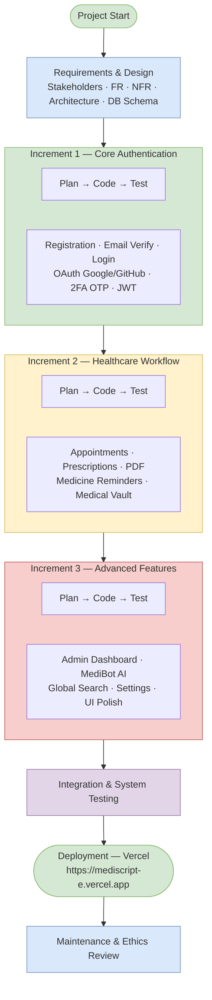
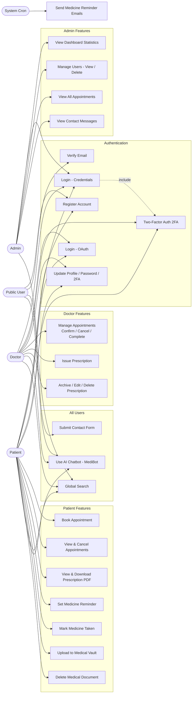
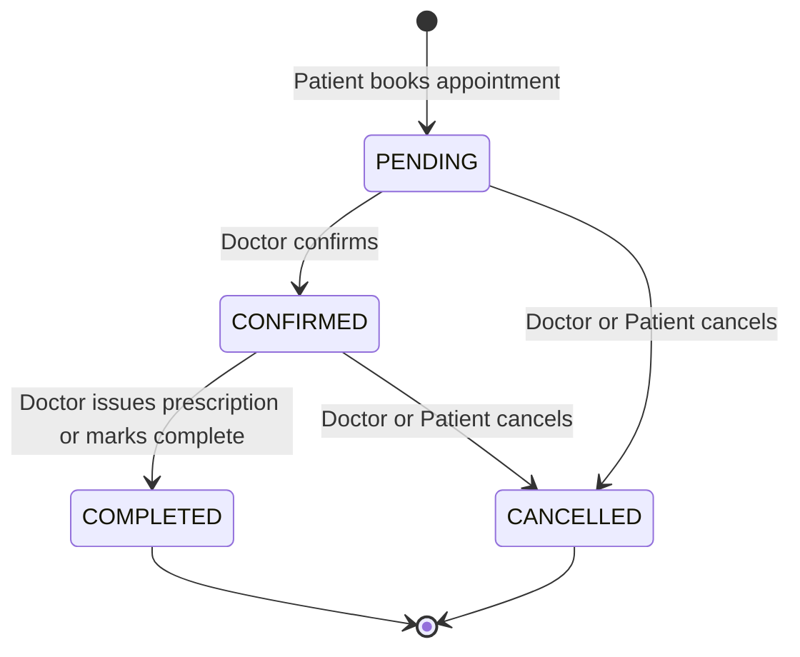
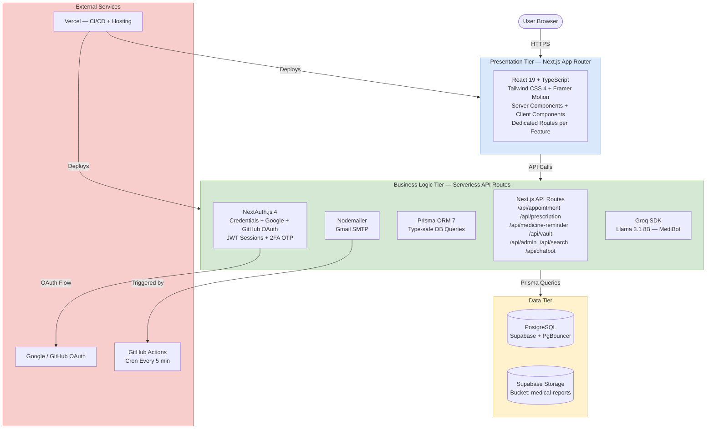
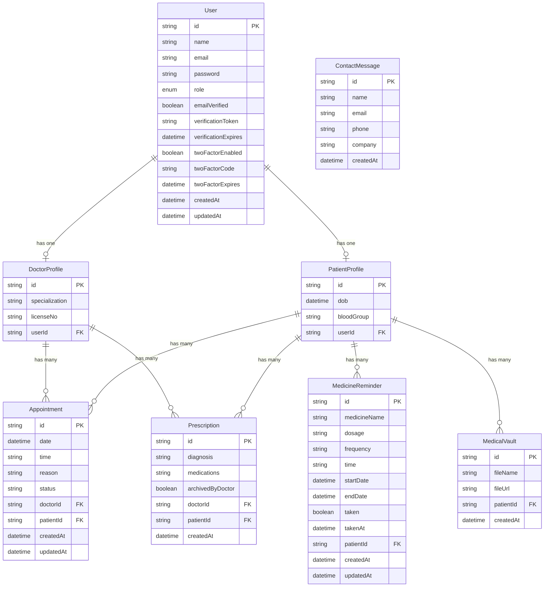
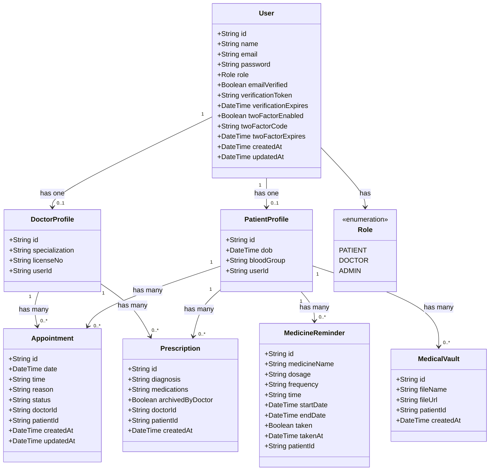
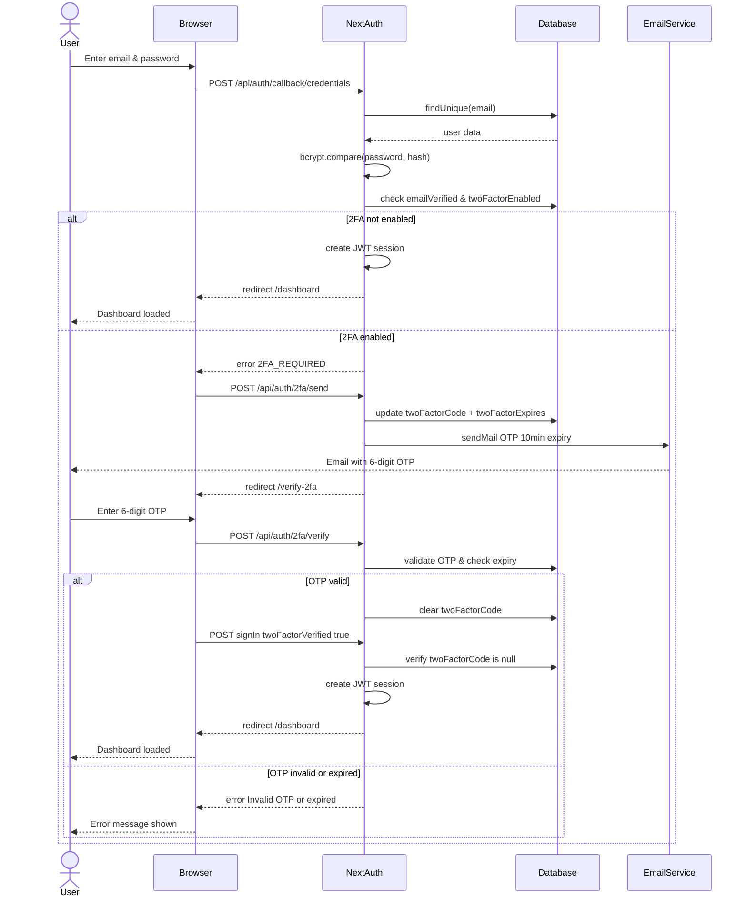
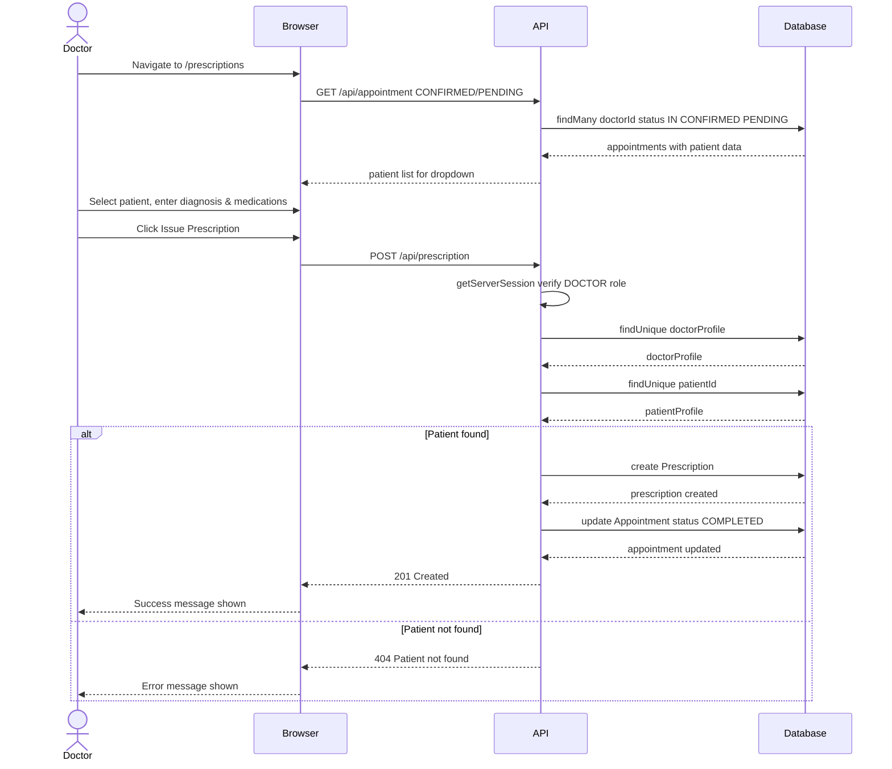
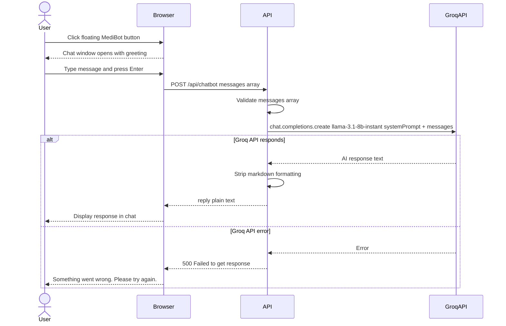

# MediScript-E — All Diagrams
# For use in Project Report Word Document
# Total: 10 Diagrams | Organized by Lab Session

---

## DIAGRAM 1 — SDLC Process Diagram
**Used in:** Lab Session 2 (Software Process Models)
**Type:** Flowchart — Incremental Development Model

---

## DIAGRAM 2 — Use Case Diagram
**Used in:** Lab Session 5 (Use Case Modeling)
**Type:** Flowchart — Actor-Use Case relationships

---

## DIAGRAM 3 — Appointment Status Flow
**Used in:** Lab Session 5 (Use Case Modeling)
**Type:** State Diagram

---

## DIAGRAM 4 — System Architecture
**Used in:** Lab Session 6 (System Design & UML)
**Type:** Flowchart — 3-Tier Architecture

---

## DIAGRAM 5 — Entity Relationship Diagram (ERD)
**Used in:** Lab Session 6 (System Design & UML)
**Type:** ER Diagram

---

## DIAGRAM 6 — Class Diagram
**Used in:** Lab Session 6 (System Design & UML)
**Type:** UML Class Diagram

---

## DIAGRAM 7 — Sequence Diagram: Login with 2FA
**Used in:** Lab Session 6 (System Design & UML)
**Type:** UML Sequence Diagram

---

## DIAGRAM 8 — Sequence Diagram: Issue Prescription
**Used in:** Lab Session 6 (System Design & UML)
**Type:** UML Sequence Diagram

---

## DIAGRAM 9 — Sequence Diagram: MediBot AI Chatbot
**Used in:** Lab Session 6 (System Design & UML)
**Type:** UML Sequence Diagram

---

## DIAGRAM 10 — Security Architecture
**Used in:** Lab Session 7 (Security Engineering)
**Type:** Layered Security Diagram

```mermaid
flowchart TD
    User([User / Browser])

    subgraph L1["Layer 1: Network Security"]
        HTTPS[HTTPS enforced via Vercel]
        SSL[SSL/TLS Database Connection]
        SecureURL[Supabase Secure Storage URLs]
    end

    subgraph L2["Layer 2: Authentication Security"]
        Bcrypt[bcryptjs Password Hashing\n10 Salt Rounds]
        EmailVerify[Email Verification\n24-hour Token Expiry]
        JWT[JWT Session\n30-day Expiry]
        OAuth[Google & GitHub OAuth\nAuto-verified + Profile Picture]
        TwoFA[2FA Email OTP\n10-minute Expiry, Single Use]
    end

    subgraph L3["Layer 3: Authorization Security"]
        RBAC[Role-Based Access Control\nPATIENT / DOCTOR / ADMIN]
        Session[getServerSession on\nAll Protected API Routes]
        Ownership[Ownership Check\nBefore PATCH / DELETE]
        AdminSelf[Admin Cannot\nDelete Own Account]
    end

    subgraph L4["Layer 4: Input Security"]
        Prisma[Prisma ORM\nPrevents SQL Injection]
        Validation[Input Validation\nAll API Routes]
        FileValidation[File Type & Size\nValidation for Uploads]
        AIPrompt[AI System Prompt\nRestricts Harmful Responses]
    end

    subgraph L5["Layer 5: Data Security"]
        NoPlaintext[Passwords Never\nStored in Plaintext]
        OTPClear[OTP Cleared After Use]
        TokenClear[Verification Tokens\nCleared After Use]
        EnvVars[All Secrets in .env\nNever in Source Code]
    end

    User --> L1 --> L2 --> L3 --> L4 --> L5

    style L1 fill:#dae8fc,stroke:#6c8ebf
    style L2 fill:#d5e8d4,stroke:#82b366
    style L3 fill:#fff2cc,stroke:#d6b656
    style L4 fill:#f8cecc,stroke:#b85450
    style L5 fill:#e1d5e7,stroke:#9673a6
```

---

## HOW TO USE IN WORD DOCUMENT

1. Go to https://mermaid.live
2. Paste each diagram code
3. Export as PNG (high resolution)
4. Insert into Word at the appropriate Lab Session section

## DIAGRAM PLACEMENT GUIDE

| Diagram | Insert After |
|---|---|
| 1. SDLC Process | Lab 2 — Selected Model section |
| 2. Use Case Diagram | Lab 5 — Task 2 |
| 3. Appointment Status Flow | Lab 5 — after Use Case Diagram |
| 4. System Architecture | Lab 6 — Task 1 |
| 5. ER Diagram | Lab 6 — Task 2 |
| 6. Class Diagram | Lab 6 — Task 4.1 |
| 7. Sequence: Login 2FA | Lab 6 — Task 4.2 |
| 8. Sequence: Issue Prescription | Lab 6 — Task 4.3 |
| 9. Sequence: MediBot | Lab 6 — Task 4.4 |
| 10. Security Architecture | Lab 7 — Security Design |
