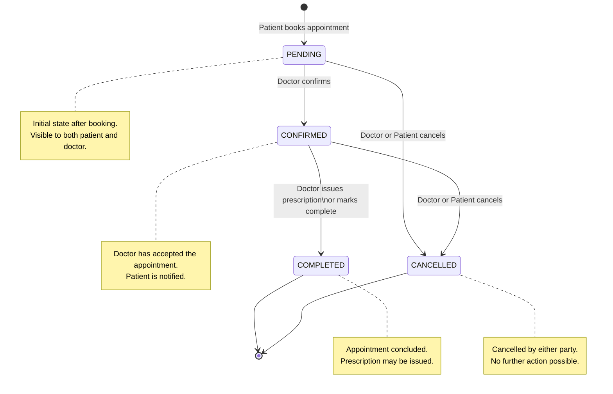

```mermaid
stateDiagram-v2
    [*] --> PENDING : Patient books appointment

    PENDING --> CONFIRMED : Doctor confirms
    PENDING --> CANCELLED : Doctor or Patient cancels

    CONFIRMED --> COMPLETED : Doctor issues prescription\nor marks complete
    CONFIRMED --> CANCELLED : Doctor or Patient cancels

    COMPLETED --> [*]
    CANCELLED --> [*]

    note right of PENDING
        Initial state after booking.
        Visible to both patient and doctor.
    end note

    note right of CONFIRMED
        Doctor has accepted the appointment.
        Patient is notified.
    end note

    note right of COMPLETED
        Appointment concluded.
        Prescription may be issued.
    end note

    note right of CANCELLED
        Cancelled by either party.
        No further action possible.
    end note
```
