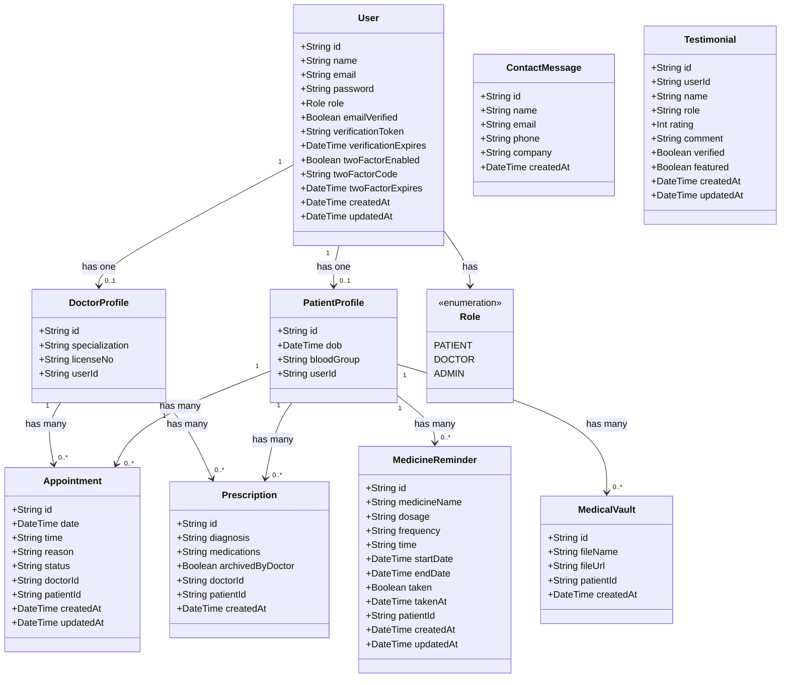

```mermaid
classDiagram
    class User {
        +String id
        +String name
        +String email
        +String password
        +Role role
        +Boolean emailVerified
        +String verificationToken
        +DateTime verificationExpires
        +Boolean twoFactorEnabled
        +String twoFactorCode
        +DateTime twoFactorExpires
        +DateTime createdAt
        +DateTime updatedAt
    }

    class DoctorProfile {
        +String id
        +String specialization
        +String licenseNo
        +String userId
    }

    class PatientProfile {
        +String id
        +DateTime dob
        +String bloodGroup
        +String userId
    }

    class Appointment {
        +String id
        +DateTime date
        +String time
        +String reason
        +String status
        +String doctorId
        +String patientId
        +DateTime createdAt
        +DateTime updatedAt
    }

    class Prescription {
        +String id
        +String diagnosis
        +String medications
        +Boolean archivedByDoctor
        +String doctorId
        +String patientId
        +DateTime createdAt
    }

    class MedicineReminder {
        +String id
        +String medicineName
        +String dosage
        +String frequency
        +String time
        +DateTime startDate
        +DateTime endDate
        +Boolean taken
        +DateTime takenAt
        +String patientId
        +DateTime createdAt
        +DateTime updatedAt
    }

    class MedicalVault {
        +String id
        +String fileName
        +String fileUrl
        +String patientId
        +DateTime createdAt
    }

    class ContactMessage {
        +String id
        +String name
        +String email
        +String phone
        +String company
        +DateTime createdAt
    }

    class Testimonial {
        +String id
        +String userId
        +String name
        +String role
        +Int rating
        +String comment
        +Boolean verified
        +Boolean featured
        +DateTime createdAt
        +DateTime updatedAt
    }

    class Role {
        <<enumeration>>
        PATIENT
        DOCTOR
        ADMIN
    }

    User "1" --> "0..1" DoctorProfile : has one
    User "1" --> "0..1" PatientProfile : has one
    User --> Role : has
    DoctorProfile "1" --> "0..*" Appointment : has many
    PatientProfile "1" --> "0..*" Appointment : has many
    DoctorProfile "1" --> "0..*" Prescription : has many
    PatientProfile "1" --> "0..*" Prescription : has many
    PatientProfile "1" --> "0..*" MedicineReminder : has many
    PatientProfile "1" --> "0..*" MedicalVault : has many
```
