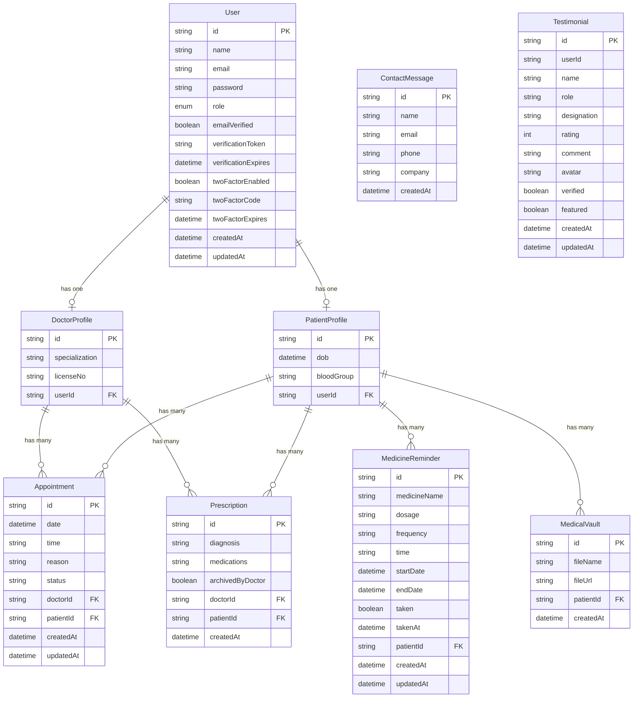

```mermaid
erDiagram
    User {
        string id PK
        string name
        string email
        string password
        enum role
        boolean emailVerified
        string verificationToken
        datetime verificationExpires
        boolean twoFactorEnabled
        string twoFactorCode
        datetime twoFactorExpires
        datetime createdAt
        datetime updatedAt
    }

    DoctorProfile {
        string id PK
        string specialization
        string licenseNo
        string userId FK
    }

    PatientProfile {
        string id PK
        datetime dob
        string bloodGroup
        string userId FK
    }

    Appointment {
        string id PK
        datetime date
        string time
        string reason
        string status
        string doctorId FK
        string patientId FK
        datetime createdAt
        datetime updatedAt
    }

    Prescription {
        string id PK
        string diagnosis
        string medications
        boolean archivedByDoctor
        string doctorId FK
        string patientId FK
        datetime createdAt
    }

    MedicineReminder {
        string id PK
        string medicineName
        string dosage
        string frequency
        string time
        datetime startDate
        datetime endDate
        boolean taken
        datetime takenAt
        string patientId FK
        datetime createdAt
        datetime updatedAt
    }

    MedicalVault {
        string id PK
        string fileName
        string fileUrl
        string patientId FK
        datetime createdAt
    }

    ContactMessage {
        string id PK
        string name
        string email
        string phone
        string company
        datetime createdAt
    }

    Testimonial {
        string id PK
        string userId
        string name
        string role
        string designation
        int rating
        string comment
        string avatar
        boolean verified
        boolean featured
        datetime createdAt
        datetime updatedAt
    }

    User ||--o| DoctorProfile : "has one"
    User ||--o| PatientProfile : "has one"
    DoctorProfile ||--o{ Appointment : "has many"
    PatientProfile ||--o{ Appointment : "has many"
    DoctorProfile ||--o{ Prescription : "has many"
    PatientProfile ||--o{ Prescription : "has many"
    PatientProfile ||--o{ MedicineReminder : "has many"
    PatientProfile ||--o{ MedicalVault : "has many"
```
