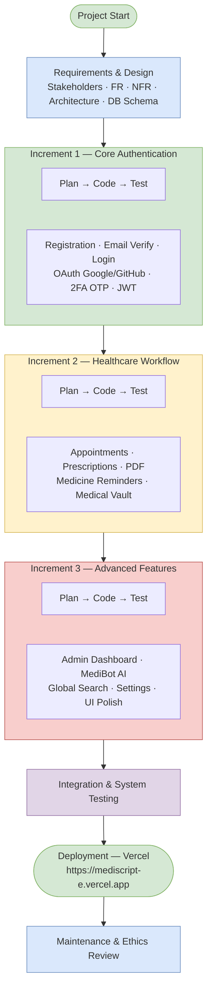

```mermaid
flowchart TD
    S([Project Start])
    R["Requirements & Design\nStakeholders · FR · NFR · Architecture · DB Schema"]

    subgraph I1["Increment 1 — Core Authentication"]
        A1["Plan → Code → Test"]
        B1["Registration · Email Verify · Login\nOAuth Google/GitHub · 2FA OTP · JWT"]
    end

    subgraph I2["Increment 2 — Healthcare Workflow"]
        A2["Plan → Code → Test"]
        B2["Appointments · Prescriptions · PDF\nMedicine Reminders · Medical Vault"]
    end

    subgraph I3["Increment 3 — Advanced Features"]
        A3["Plan → Code → Test"]
        B3["Admin Dashboard · MediBot AI\nGlobal Search · Settings · UI Polish"]
    end

    D["Integration & System Testing"]
    E(["Deployment — Vercel\nhttps://mediscript-e.vercel.app"])
    M["Maintenance & Ethics Review"]

    S --> R
    R --> I1
    I1 --> I2
    I2 --> I3
    I3 --> D
    D --> E
    E --> M

    style S fill:#d5e8d4,stroke:#82b366
    style R fill:#dae8fc,stroke:#6c8ebf
    style I1 fill:#d5e8d4,stroke:#82b366
    style I2 fill:#fff2cc,stroke:#d6b656
    style I3 fill:#f8cecc,stroke:#b85450
    style D fill:#e1d5e7,stroke:#9673a6
    style E fill:#d5e8d4,stroke:#82b366
    style M fill:#dae8fc,stroke:#6c8ebf
```
