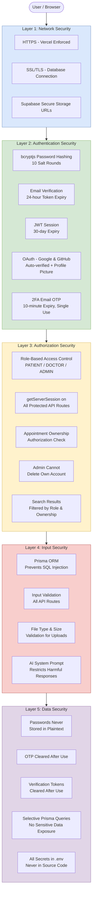

```mermaid
flowchart TD
    User([User / Browser])

    subgraph Layer1["Layer 1: Network Security"]
        HTTPS[HTTPS - Vercel Enforced]
        SSL[SSL/TLS - Database Connection]
        SecureURL[Supabase Secure Storage URLs]
    end

    subgraph Layer2["Layer 2: Authentication Security"]
        Bcrypt[bcryptjs Password Hashing\n10 Salt Rounds]
        EmailVerify[Email Verification\n24-hour Token Expiry]
        JWT[JWT Session\n30-day Expiry]
        OAuth[OAuth - Google & GitHub\nAuto-verified + Profile Picture]
        TwoFA[2FA Email OTP\n10-minute Expiry, Single Use]
    end

    subgraph Layer3["Layer 3: Authorization Security"]
        RBAC[Role-Based Access Control\nPATIENT / DOCTOR / ADMIN]
        Session[getServerSession on\nAll Protected API Routes]
        Ownership[Appointment Ownership\nAuthorization Check]
        AdminSelf[Admin Cannot\nDelete Own Account]
        SearchFilter[Search Results\nFiltered by Role & Ownership]
    end

    subgraph Layer4["Layer 4: Input Security"]
        Prisma[Prisma ORM\nPrevents SQL Injection]
        Validation[Input Validation\nAll API Routes]
        FileValidation[File Type & Size\nValidation for Uploads]
        AIPrompt[AI System Prompt\nRestricts Harmful Responses]
    end

    subgraph Layer5["Layer 5: Data Security"]
        NoPlaintext[Passwords Never\nStored in Plaintext]
        OTPClear[OTP Cleared After Use]
        TokenClear[Verification Tokens\nCleared After Use]
        SelectiveQuery[Selective Prisma Queries\nNo Sensitive Data Exposure]
        EnvVars[All Secrets in .env\nNever in Source Code]
    end

    User --> Layer1
    Layer1 --> Layer2
    Layer2 --> Layer3
    Layer3 --> Layer4
    Layer4 --> Layer5

    style Layer1 fill:#dae8fc,stroke:#6c8ebf
    style Layer2 fill:#d5e8d4,stroke:#82b366
    style Layer3 fill:#fff2cc,stroke:#d6b656
    style Layer4 fill:#f8cecc,stroke:#b85450
    style Layer5 fill:#e1d5e7,stroke:#9673a6
```
