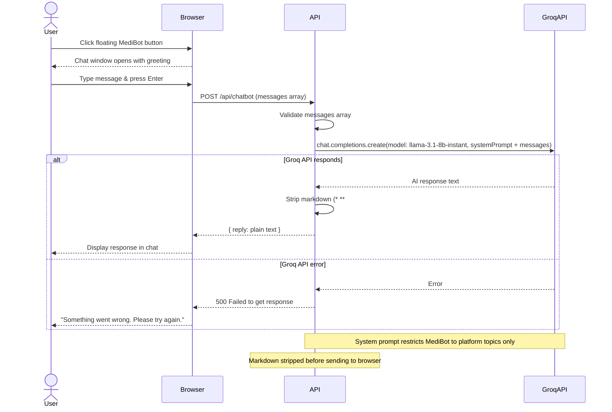

```mermaid
sequenceDiagram
    actor User
    participant Browser
    participant API
    participant GroqAPI

    User->>Browser: Click floating MediBot button
    Browser-->>User: Chat window opens with greeting

    User->>Browser: Type message & press Enter
    Browser->>API: POST /api/chatbot (messages array)
    API->>API: Validate messages array

    API->>GroqAPI: chat.completions.create(model: llama-3.1-8b-instant, systemPrompt + messages)

    alt Groq API responds
        GroqAPI-->>API: AI response text
        API->>API: Strip markdown (* ** # -)
        API-->>Browser: { reply: plain text }
        Browser-->>User: Display response in chat
    else Groq API error
        GroqAPI-->>API: Error
        API-->>Browser: 500 Failed to get response
        Browser-->>User: "Something went wrong. Please try again."
    end

    Note over API,GroqAPI: System prompt restricts MediBot to platform topics only
    Note over API: Markdown stripped before sending to browser
```
