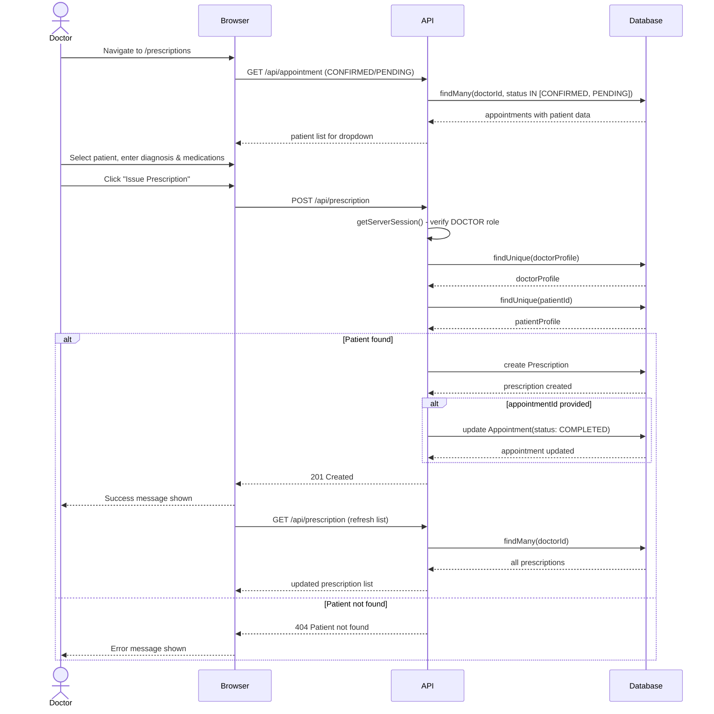

```mermaid
sequenceDiagram
    actor Doctor
    participant Browser
    participant API
    participant Database

    Doctor->>Browser: Navigate to /prescriptions
    Browser->>API: GET /api/appointment (CONFIRMED/PENDING)
    API->>Database: findMany(doctorId, status IN [CONFIRMED, PENDING])
    Database-->>API: appointments with patient data
    API-->>Browser: patient list for dropdown

    Doctor->>Browser: Select patient, enter diagnosis & medications
    Doctor->>Browser: Click "Issue Prescription"
    Browser->>API: POST /api/prescription
    API->>API: getServerSession() - verify DOCTOR role
    API->>Database: findUnique(doctorProfile)
    Database-->>API: doctorProfile
    API->>Database: findUnique(patientId)
    Database-->>API: patientProfile

    alt Patient found
        API->>Database: create Prescription
        Database-->>API: prescription created

        alt appointmentId provided
            API->>Database: update Appointment(status: COMPLETED)
            Database-->>API: appointment updated
        end

        API-->>Browser: 201 Created
        Browser-->>Doctor: Success message shown
        Browser->>API: GET /api/prescription (refresh list)
        API->>Database: findMany(doctorId)
        Database-->>API: all prescriptions
        API-->>Browser: updated prescription list
    else Patient not found
        API-->>Browser: 404 Patient not found
        Browser-->>Doctor: Error message shown
    end
```
