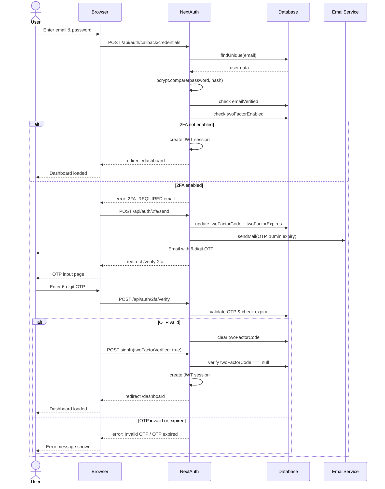

```mermaid
sequenceDiagram
    actor User
    participant Browser
    participant NextAuth
    participant Database
    participant EmailService

    User->>Browser: Enter email & password
    Browser->>NextAuth: POST /api/auth/callback/credentials
    NextAuth->>Database: findUnique(email)
    Database-->>NextAuth: user data
    NextAuth->>NextAuth: bcrypt.compare(password, hash)
    NextAuth->>Database: check emailVerified
    NextAuth->>Database: check twoFactorEnabled

    alt 2FA not enabled
        NextAuth->>NextAuth: create JWT session
        NextAuth-->>Browser: redirect /dashboard
        Browser-->>User: Dashboard loaded
    else 2FA enabled
        NextAuth-->>Browser: error: 2FA_REQUIRED:email
        Browser->>NextAuth: POST /api/auth/2fa/send
        NextAuth->>Database: update twoFactorCode + twoFactorExpires
        NextAuth->>EmailService: sendMail(OTP, 10min expiry)
        EmailService-->>User: Email with 6-digit OTP
        NextAuth-->>Browser: redirect /verify-2fa
        Browser-->>User: OTP input page

        User->>Browser: Enter 6-digit OTP
        Browser->>NextAuth: POST /api/auth/2fa/verify
        NextAuth->>Database: validate OTP & check expiry

        alt OTP valid
            NextAuth->>Database: clear twoFactorCode
            Browser->>NextAuth: POST signIn(twoFactorVerified: true)
            NextAuth->>Database: verify twoFactorCode === null
            NextAuth->>NextAuth: create JWT session
            NextAuth-->>Browser: redirect /dashboard
            Browser-->>User: Dashboard loaded
        else OTP invalid or expired
            NextAuth-->>Browser: error: Invalid OTP / OTP expired
            Browser-->>User: Error message shown
        end
    end
```
