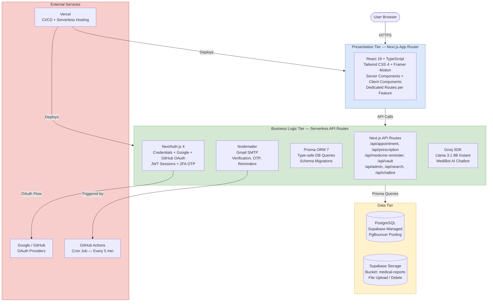

```mermaid
flowchart TD
    Browser([User Browser])

    subgraph Presentation["Presentation Tier — Next.js App Router"]
        UI["React 19 + TypeScript\nTailwind CSS 4 + Framer Motion\nServer Components + Client Components\nDedicated Routes per Feature"]
    end

    subgraph Business["Business Logic Tier — Serverless API Routes"]
        API["Next.js API Routes\n/api/appointment, /api/prescription\n/api/medicine-reminder, /api/vault\n/api/admin, /api/search, /api/chatbot"]
        Auth["NextAuth.js 4\nCredentials + Google + GitHub OAuth\nJWT Sessions + 2FA OTP"]
        ORM["Prisma ORM 7\nType-safe DB Queries\nSchema Migrations"]
        Email["Nodemailer\nGmail SMTP\nVerification, OTP, Reminders"]
        AI["Groq SDK\nLlama 3.1 8B Instant\nMediBot AI Chatbot"]
    end

    subgraph Data["Data Tier"]
        DB[("PostgreSQL\nSupabase Managed\nPgBouncer Pooling")]
        Storage[("Supabase Storage\nBucket: medical-reports\nFile Upload / Delete")]
    end

    subgraph External["External Services"]
        GoogleGitHub["Google / GitHub\nOAuth Providers"]
        Vercel["Vercel\nCI/CD + Serverless Hosting"]
        GHActions["GitHub Actions\nCron Job — Every 5 min"]
    end

    Browser -->|HTTPS| Presentation
    Presentation -->|API Calls| Business
    Business -->|Prisma Queries| Data
    Auth -->|OAuth Flow| GoogleGitHub
    Email -->|Triggered by| GHActions
    Vercel -->|Deploys| Presentation
    Vercel -->|Deploys| Business

    style Presentation fill:#dae8fc,stroke:#6c8ebf
    style Business fill:#d5e8d4,stroke:#82b366
    style Data fill:#fff2cc,stroke:#d6b656
    style External fill:#f8cecc,stroke:#b85450
```
