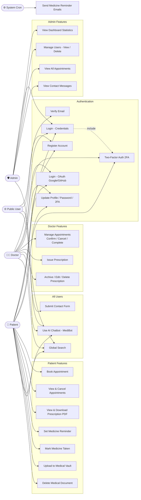

```mermaid
flowchart LR
    Patient([👤 Patient])
    Doctor([👨‍⚕️ Doctor])
    Admin([🛡️ Admin])
    Public([🌐 Public User])
    Cron([⚙️ System Cron])

    subgraph Auth["Authentication"]
        UC1[Register Account]
        UC2[Verify Email]
        UC3[Login - Credentials]
        UC4[Login - OAuth Google/GitHub]
        UC5[Two-Factor Auth 2FA]
        UC6[Update Profile / Password / 2FA]
    end

    subgraph PatientUC["Patient Features"]
        UC7[Book Appointment]
        UC8[View & Cancel Appointments]
        UC9[View & Download Prescription PDF]
        UC10[Set Medicine Reminder]
        UC11[Mark Medicine Taken]
        UC12[Upload to Medical Vault]
        UC13[Delete Medical Document]
    end

    subgraph DoctorUC["Doctor Features"]
        UC14[Manage Appointments\nConfirm / Cancel / Complete]
        UC15[Issue Prescription]
        UC16[Archive / Edit / Delete Prescription]
    end

    subgraph AdminUC["Admin Features"]
        UC17[View Dashboard Statistics]
        UC18[Manage Users - View / Delete]
        UC19[View All Appointments]
        UC20[View Contact Messages]
    end

    subgraph AllUsers["All Users"]
        UC21[Use AI Chatbot - MediBot]
        UC22[Global Search]
        UC23[Submit Contact Form]
    end

    Patient --> UC1
    Patient --> UC3
    Patient --> UC4
    Patient --> UC5
    Patient --> UC6
    Patient --> UC7
    Patient --> UC8
    Patient --> UC9
    Patient --> UC10
    Patient --> UC11
    Patient --> UC12
    Patient --> UC13
    Patient --> UC21
    Patient --> UC22

    Doctor --> UC3
    Doctor --> UC4
    Doctor --> UC5
    Doctor --> UC6
    Doctor --> UC14
    Doctor --> UC15
    Doctor --> UC16
    Doctor --> UC21
    Doctor --> UC22

    Admin --> UC3
    Admin --> UC17
    Admin --> UC18
    Admin --> UC19
    Admin --> UC20
    Admin --> UC22

    Public --> UC1
    Public --> UC2
    Public --> UC23
    Public --> UC21

    Cron --> UC24[Send Medicine Reminder Emails]

    UC3 -.->|include| UC5
```
