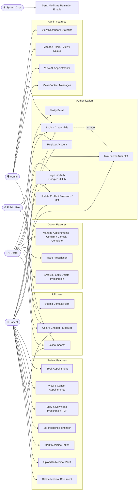

# LAB SESSION 5
## Lab Name: Use Case Modeling & System Behavior
## Project: MediScript-E — Digital Healthcare Platform

---

## Objectives
- Model system behavior of MediScript-E
- Identify interactions between users and the system
- Document detailed use case specifications for all major workflows

---

## Theory
Use cases describe how users achieve goals using the system. For MediScript-E, use cases capture every interaction between actors (Patient, Doctor, Admin, Public) and the system.

They form the basis for:
- **Design:** Guides system architecture and module structure
- **Testing:** Each use case becomes a test scenario
- **Validation:** Confirms the system meets user needs

---

## Task 1: System Actors

| Actor | Type | Description |
|-------|------|-------------|
| Patient | Primary | Registered user who books appointments, manages health records, and views prescriptions |
| Doctor | Primary | Registered medical professional who manages appointments and issues prescriptions |
| Admin | Primary | Platform administrator who monitors and manages the entire system |
| Public User | Primary | Unauthenticated visitor who browses the landing page and submits contact form |
| System (Cron) | Secondary | Automated system that sends medicine reminder emails on schedule |
| Email Service (Nodemailer) | Secondary | External Gmail SMTP service that delivers emails |
| OAuth Provider (Google/GitHub) | Secondary | External authentication providers with profile pictures |
| Supabase Storage | Secondary | External file storage service for medical documents |
| Groq AI API | Secondary | External AI service powering MediBot chatbot |

---

## Task 2: Use Case Diagram



---

## Task 3: Use Case Specifications

---

### UC-01: User Registration

| Field | Details |
|-------|---------|
| **Use Case ID** | UC-01 |
| **Use Case Name** | User Registration |
| **Actor** | Public User |
| **Description** | A new user registers on MediScript-E as a PATIENT or DOCTOR |
| **Preconditions** | User is not logged in. User has a valid email address |
| **Postconditions** | User account is created with unverified status. Verification email is sent |
| **Trigger** | User clicks "Get Started" or "Create Account" |

**Main Flow:**
1. User navigates to `/register`
2. User enters name, email, password, and selects role (PATIENT/DOCTOR)
3. If DOCTOR, user enters specialization and license number
4. If PATIENT, user selects blood group
5. System validates all inputs
6. System checks if email already exists
7. System creates user account with `emailVerified: false`
8. System sends verification email with unique token (expires in 24 hours)
9. System displays success message

**Alternative Flow:**
- **A1 (Email already exists):** System returns error "Email already registered"
- **A2 (Invalid email format):** System returns validation error
- **A3 (Password too short):** System returns "Password must be at least 6 characters"
- **A4 (Duplicate license number):** System returns error for doctor registration

---

### UC-02: Email Verification

| Field | Details |
|-------|---------|
| **Use Case ID** | UC-02 |
| **Use Case Name** | Email Verification |
| **Actor** | Public User |
| **Description** | User verifies their email address by clicking the verification link |
| **Preconditions** | User has registered and received verification email |
| **Postconditions** | User `emailVerified` is set to `true`. User can now login |
| **Trigger** | User clicks verification link in email |

**Main Flow:**
1. User clicks verification link in email
2. System validates the token
3. System checks token expiry (24 hours)
4. System sets `emailVerified: true` and clears token
5. System redirects user to login page with success message

**Alternative Flow:**
- **A1 (Token expired):** System displays "Verification link expired. Please resend."
- **A2 (Invalid token):** System displays "Invalid verification link"
- **A3 (Already verified):** System redirects to login directly

---

### UC-03: User Login (Credentials)

| Field | Details |
|-------|---------|
| **Use Case ID** | UC-03 |
| **Use Case Name** | User Login with Credentials |
| **Actor** | Patient, Doctor, Admin |
| **Description** | Verified user logs in using email and password |
| **Preconditions** | User is registered and email is verified |
| **Postconditions** | User is authenticated and redirected to dashboard |
| **Trigger** | User submits login form |

**Main Flow:**
1. User navigates to `/login`
2. User enters email and password
3. System validates credentials against database
4. System checks `emailVerified` status
5. System checks if 2FA is enabled
6. If 2FA disabled: System creates JWT session and redirects to `/dashboard`
7. If 2FA enabled: System sends OTP email and redirects to `/verify-2fa`

**Alternative Flow:**
- **A1 (Wrong password):** System returns "Invalid Email or Password"
- **A2 (Email not verified):** System shows "Please verify your email" with resend option
- **A3 (User not found):** System returns "Invalid Email or Password"

---

### UC-04: OAuth Login (Google / GitHub)

| Field | Details |
|-------|---------|
| **Use Case ID** | UC-04 |
| **Use Case Name** | OAuth Login |
| **Actor** | Public User |
| **Description** | User logs in using Google or GitHub OAuth with profile picture |
| **Preconditions** | User has a valid Google or GitHub account |
| **Postconditions** | User is authenticated. Profile picture stored in session. New users get a PATIENT account auto-created |
| **Trigger** | User clicks "Google" or "GitHub" button on login page |

**Main Flow:**
1. User clicks OAuth provider button
2. System redirects to OAuth provider
3. User authenticates with provider
4. Provider returns user email, profile name, and profile picture
5. System checks if user exists in database
6. If new user: System creates PATIENT account with `emailVerified: true`
7. System stores profile picture URL in JWT token and session
8. System creates JWT session and redirects to `/dashboard`
9. Profile picture displayed in navbar and dashboard sidebar

**Alternative Flow:**
- **A1 (OAuth denied):** User cancels OAuth flow, redirected back to login
- **A2 (Existing user without patient profile):** System creates patient profile automatically

---

### UC-05: Two-Factor Authentication (2FA)

| Field | Details |
|-------|---------|
| **Use Case ID** | UC-05 |
| **Use Case Name** | Two-Factor Authentication |
| **Actor** | Patient, Doctor |
| **Description** | User completes 2FA verification via email OTP after successful password login |
| **Preconditions** | User has 2FA enabled in settings. User has entered correct password |
| **Postconditions** | User is fully authenticated and redirected to dashboard |
| **Trigger** | System detects 2FA is enabled after password verification |

**Main Flow:**
1. System sends 6-digit OTP to user's registered email
2. System redirects user to `/verify-2fa?email=...`
3. User enters 6-digit OTP in input fields
4. System validates OTP and checks expiry (10 minutes)
5. System clears OTP from database
6. System creates JWT session and redirects to `/dashboard`

**Alternative Flow:**
- **A1 (Wrong OTP):** System returns "Invalid OTP"
- **A2 (Expired OTP):** System returns "OTP has expired"
- **A3 (Resend OTP):** User clicks resend after 60-second cooldown, new OTP sent

---

### UC-06: Book Appointment

| Field | Details |
|-------|---------|
| **Use Case ID** | UC-06 |
| **Use Case Name** | Book Appointment |
| **Actor** | Patient |
| **Description** | Patient books an appointment with an available doctor |
| **Preconditions** | Patient is logged in. At least one doctor is registered |
| **Postconditions** | Appointment is created with status `PENDING` |
| **Trigger** | Patient navigates to `/appointments` page |

**Main Flow:**
1. Patient navigates to `/appointments`
2. System displays appointment booking form and existing appointments
3. Patient selects a doctor from dropdown
4. Patient selects appointment date and time slot
5. Patient optionally enters reason for visit
6. Patient submits booking form
7. System creates appointment with status `PENDING`
8. System displays success confirmation

**Alternative Flow:**
- **A1 (No doctors available):** System displays "No doctors available"
- **A2 (Missing required fields):** System shows validation error

---

### UC-07: Manage Appointment (Doctor)

| Field | Details |
|-------|---------|
| **Use Case ID** | UC-07 |
| **Use Case Name** | Manage Appointment |
| **Actor** | Doctor |
| **Description** | Doctor confirms, cancels, or completes a patient appointment |
| **Preconditions** | Doctor is logged in. Appointments exist for the doctor |
| **Postconditions** | Appointment status is updated accordingly |
| **Trigger** | Doctor navigates to `/appointments` page |

**Main Flow:**
1. Doctor navigates to `/appointments`
2. System displays all appointments with filter tabs (ALL/PENDING/CONFIRMED/COMPLETED/CANCELLED)
3. Default filter shows PENDING appointments
4. Doctor selects an action: Confirm / Cancel / Complete
5. System shows confirmation dialog for Complete and Cancel actions
6. System updates appointment status in database

**Appointment Status Flow:**
```
PENDING → CONFIRMED → COMPLETED
   ↓
CANCELLED
```

**Alternative Flow:**
- **A1 (No appointments):** System displays "No appointments found"
- **A2 (Accidental click):** Confirmation dialog prevents unintended status changes

---

### UC-08: Issue Prescription

| Field | Details |
|-------|---------|
| **Use Case ID** | UC-08 |
| **Use Case Name** | Issue Prescription |
| **Actor** | Doctor |
| **Description** | Doctor issues a digital prescription for a patient |
| **Preconditions** | Doctor is logged in. Patient has a confirmed/pending appointment |
| **Postconditions** | Prescription is saved, visible to patient, and appointment auto-completed |
| **Trigger** | Doctor navigates to `/prescriptions` page |

**Main Flow:**
1. Doctor navigates to `/prescriptions`
2. Doctor selects patient from dropdown (shows confirmed/pending appointments)
3. Doctor enters diagnosis and medications
4. System validates inputs
5. System creates prescription linked to doctor and patient
6. System automatically marks the related appointment as COMPLETED
7. Prescription becomes visible in patient's `/prescriptions` page

**Alternative Flow:**
- **A1 (No confirmed appointments):** Dropdown shows no patients
- **A2 (Missing fields):** System shows validation error

---

### UC-09: Archive/Edit/Delete Prescription (Doctor)

| Field | Details |
|-------|---------|
| **Use Case ID** | UC-09 |
| **Use Case Name** | Manage Issued Prescriptions |
| **Actor** | Doctor |
| **Description** | Doctor archives, edits, or deletes an issued prescription |
| **Preconditions** | Doctor is logged in. Prescriptions exist |
| **Postconditions** | Prescription is archived/updated/deleted accordingly |
| **Trigger** | Doctor views prescription list on `/prescriptions` page |

**Main Flow:**
1. Doctor views prescription list with Active/Archived tabs
2. Doctor clicks Archive icon → prescription moves to Archived tab
3. Doctor clicks Edit icon → inline edit form appears
4. Doctor updates diagnosis/medications and saves
5. Doctor clicks Delete icon → confirmation dialog appears
6. System deletes prescription after confirmation

**Alternative Flow:**
- **A1 (Archived prescription):** Edit button hidden for archived prescriptions
- **A2 (Cancel edit):** Changes discarded, original data restored

---

### UC-10: View & Download Prescription (Patient)

| Field | Details |
|-------|---------|
| **Use Case ID** | UC-10 |
| **Use Case Name** | View and Download Prescription |
| **Actor** | Patient |
| **Description** | Patient views their prescriptions and downloads as PDF |
| **Preconditions** | Patient is logged in. At least one prescription exists |
| **Postconditions** | PDF is downloaded to patient's device |
| **Trigger** | Patient navigates to `/prescriptions` |

**Main Flow:**
1. Patient navigates to `/prescriptions`
2. System displays all prescriptions with doctor name, diagnosis, medications, and date
3. Patient clicks "Download PDF"
4. System generates PDF using html2canvas and jsPDF
5. PDF is downloaded to patient's device

**Alternative Flow:**
- **A1 (No prescriptions):** System displays "No prescriptions found"

---

### UC-11: Medicine Reminder

| Field | Details |
|-------|---------|
| **Use Case ID** | UC-11 |
| **Use Case Name** | Set Medicine Reminder |
| **Actor** | Patient, System (Cron) |
| **Description** | Patient sets a medicine reminder and system sends automated email alerts |
| **Preconditions** | Patient is logged in |
| **Postconditions** | Reminder is saved. Email alerts sent at scheduled time |
| **Trigger** | Patient navigates to `/reminders` |

**Main Flow:**
1. Patient navigates to `/reminders`
2. Patient enters medicine name, dosage, frequency, time, start date, and end date
3. System saves reminder linked to patient profile
4. At scheduled time, cron job calls send-notifications endpoint
5. System sends email alert to patient
6. Patient can mark medicine as taken or undo

**Alternative Flow:**
- **A1 (Cron job fails):** Email not sent, reminder remains pending
- **A2 (Patient deletes reminder):** Reminder removed, no further emails sent

---

### UC-12: Medical Vault

| Field | Details |
|-------|---------|
| **Use Case ID** | UC-12 |
| **Use Case Name** | Upload Medical Document |
| **Actor** | Patient |
| **Description** | Patient uploads a medical document to their secure Medical Vault |
| **Preconditions** | Patient is logged in |
| **Postconditions** | Document is stored in Supabase Storage and record saved in database |
| **Trigger** | Patient navigates to `/vault` |

**Main Flow:**
1. Patient navigates to `/vault`
2. Patient selects a file from their device
3. System validates file type and size
4. System uploads file to Supabase Storage
5. System saves file metadata in database
6. System displays uploaded document in vault

**Alternative Flow:**
- **A1 (Invalid file type):** System returns validation error
- **A2 (File too large):** System returns size limit error

---

### UC-13: AI Chatbot (MediBot)

| Field | Details |
|-------|---------|
| **Use Case ID** | UC-13 |
| **Use Case Name** | Use AI Chatbot |
| **Actor** | All Users |
| **Description** | User interacts with MediBot AI assistant for platform-related help |
| **Preconditions** | User is on any page of MediScript-E |
| **Postconditions** | User receives helpful response about the platform |
| **Trigger** | User clicks the floating chat button |

**Main Flow:**
1. User clicks floating MediBot button (bottom-right of any page)
2. Chat window opens with greeting message
3. User types a question about MediScript-E
4. System sends message to Groq API (Llama 3.1 model) with platform context
5. AI generates response based on system prompt
6. Response displayed in chat window in plain English
7. Conversation history maintained within session

**Alternative Flow:**
- **A1 (Unrelated question):** MediBot redirects to platform-related topics
- **A2 (Medical advice request):** MediBot recommends consulting a real doctor
- **A3 (API error):** System displays "Something went wrong. Please try again."

---

### UC-14: Global Search

| Field | Details |
|-------|---------|
| **Use Case ID** | UC-14 |
| **Use Case Name** | Global Search |
| **Actor** | Patient, Doctor, Admin |
| **Description** | Authenticated user searches across their relevant data |
| **Preconditions** | User is logged in and on dashboard |
| **Postconditions** | Relevant search results displayed in dropdown |
| **Trigger** | User types in the search bar in dashboard header |

**Main Flow:**
1. User types in search bar (350ms debounce)
2. System calls `/api/search?q=...` with user's role
3. Patient: searches appointments (doctor name, status) and prescriptions (diagnosis)
4. Doctor: searches appointments (patient name) and patients (name, blood group)
5. Admin: searches users (name, email, role) and appointments
6. Results displayed in dropdown with categories
7. User clicks result → scrolls to relevant section

**Alternative Flow:**
- **A1 (No results):** System displays "No results found."
- **A2 (Empty query):** Dropdown closes, no API call made

---

### UC-15: Admin Dashboard

| Field | Details |
|-------|---------|
| **Use Case ID** | UC-15 |
| **Use Case Name** | View Admin Dashboard |
| **Actor** | Admin |
| **Description** | Admin views real-time platform statistics and manages users |
| **Preconditions** | Admin is logged in |
| **Postconditions** | Admin has full visibility of platform activity |
| **Trigger** | Admin logs in and navigates to `/dashboard` |

**Main Flow:**
1. Admin logs in with admin credentials
2. System displays real-time statistics: total users, patients, doctors, appointments, prescriptions, contacts
3. Each stat card links to the relevant dedicated page
4. Admin navigates to `/users` for user management
5. Admin navigates to `/appointments` for appointment overview
6. Admin navigates to `/contacts` for contact messages
7. Admin can delete any user except themselves

**Alternative Flow:**
- **A1 (Delete self):** System prevents admin from deleting their own account

---

## Key Findings / Learning Outcomes
- Successfully identified **9 actors** and **15 use cases** for MediScript-E
- New use cases added: OAuth with Profile Picture (UC-04), Manage Prescriptions (UC-09), AI Chatbot (UC-13), Global Search (UC-14)
- Learned to model complex healthcare workflows using use case specifications
- Understood how use cases directly map to dedicated page routes in the implementation
- Recognized that alternative flows are critical for robust system design
- Use case modeling helped identify edge cases such as prescription auto-complete on issuance and confirmation dialogs for irreversible actions
