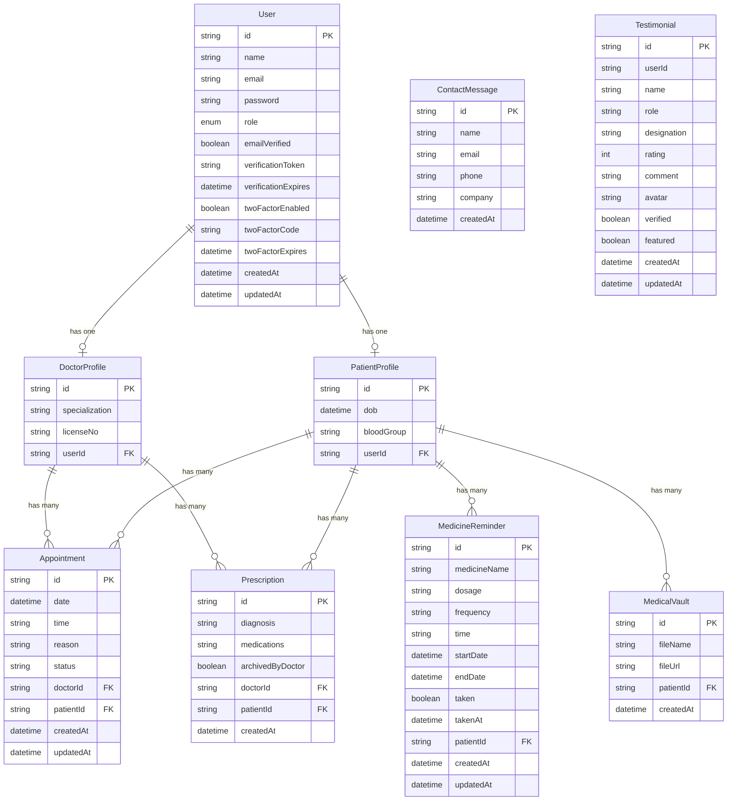
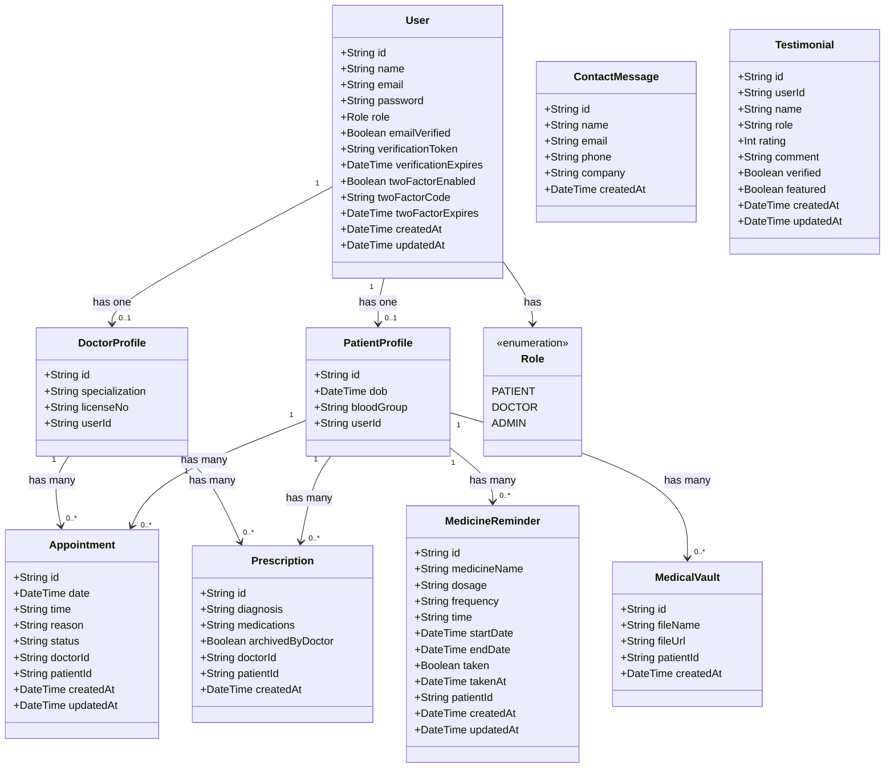

# LAB SESSION 6
## Lab Name: System Design & UML Modeling
## Project: MediScript-E — Digital Healthcare Platform

---

## Objectives
- Design the system architecture of MediScript-E
- Apply UML modeling for software design documentation
- Translate requirements into a concrete system design

---

## Theory
Software design defines how the system will be built. Good design ensures:
- **Maintainability:** Easy to modify and extend
- **Scalability:** Can handle growing users and data
- **Low Coupling:** Components are independent and reusable

UML (Unified Modeling Language) diagrams communicate design clearly to all stakeholders.

---

## Task 1: System Architecture

MediScript-E follows a **3-Tier Architecture**:

```
┌─────────────────────────────────────────┐
│           PRESENTATION TIER             │
│   Next.js 16 App Router (React 19)      │
│   Tailwind CSS + Framer Motion          │
│   Client Components + Server Components │
│   Dedicated Routes per Feature          │
└─────────────────────────────────────────┘
                    │
                    ▼
┌─────────────────────────────────────────┐
│           BUSINESS LOGIC TIER           │
│   Next.js API Routes (Serverless)       │
│   NextAuth.js (Authentication)          │
│   Prisma ORM (Data Access Layer)        │
│   Nodemailer (Email Service)            │
│   Groq SDK (AI Chatbot)                 │
└─────────────────────────────────────────┘
                    │
                    ▼
┌─────────────────────────────────────────┐
│              DATA TIER                  │
│   PostgreSQL (Supabase)                 │
│   Supabase Storage (File Storage)       │
└─────────────────────────────────────────┘
```

### Architecture Components

| Component | Technology | Responsibility |
|-----------|-----------|----------------|
| Frontend | Next.js 16, React 19, Tailwind CSS | UI rendering, user interaction |
| Authentication | NextAuth.js 4, bcryptjs | Session management, OAuth, 2FA, profile pictures |
| API Layer | Next.js API Routes (Serverless) | Business logic, data validation |
| ORM | Prisma 7 | Database queries, schema management |
| Database | PostgreSQL (Supabase) | Persistent data storage |
| File Storage | Supabase Storage | Medical document storage |
| Email | Nodemailer (Gmail SMTP) | Verification, OTP, reminders |
| AI Chatbot | Groq SDK (Llama 3.1) | MediBot AI assistant |
| Deployment | Vercel | Hosting, CI/CD, serverless functions |

### Deployment Architecture

```
[User Browser]
      │
      ▼
[Vercel CDN / Edge Network]
      │
      ├──► [Next.js Static Pages] (Landing, Login, Register)
      │
      └──► [Vercel Serverless Functions] (API Routes)
                    │
                    ├──► [Supabase PostgreSQL] (Database)
                    │
                    ├──► [Supabase Storage] (File Storage)
                    │
                    ├──► [Gmail SMTP] (Email Service)
                    │
                    └──► [Groq API] (AI Chatbot)
```

---

## Task 2: Database Schema Design

### Entity Relationship Overview



### Database Models

#### User Model
```
User {
  id                  String    (PK, CUID)
  name                String?
  email               String    (Unique)
  password            String
  role                Role      (PATIENT | DOCTOR | ADMIN)
  emailVerified       Boolean   (default: false)
  verificationToken   String?   (Unique)
  verificationExpires DateTime?
  twoFactorEnabled    Boolean   (default: false)
  twoFactorCode       String?
  twoFactorExpires    DateTime?
  createdAt           DateTime
  updatedAt           DateTime
}
```

#### DoctorProfile Model
```
DoctorProfile {
  id              String  (PK, CUID)
  specialization  String  (default: "General")
  licenseNo       String  (Unique)
  userId          String  (FK → User.id, Unique)
}
```

#### PatientProfile Model
```
PatientProfile {
  id          String   (PK, CUID)
  dob         DateTime
  bloodGroup  String   (default: "O+")
  userId      String   (FK → User.id, Unique)
}
```

#### Appointment Model
```
Appointment {
  id        String   (PK, CUID)
  date      DateTime
  time      String
  reason    String?
  status    String   (PENDING | CONFIRMED | COMPLETED | CANCELLED)
  doctorId  String   (FK → DoctorProfile.id)
  patientId String   (FK → PatientProfile.id)
  createdAt DateTime
  updatedAt DateTime
}
```

#### Prescription Model
```
Prescription {
  id               String   (PK, CUID)
  diagnosis        String
  medications      String
  archivedByDoctor Boolean  (default: false)
  doctorId         String   (FK → DoctorProfile.id)
  patientId        String   (FK → PatientProfile.id)
  createdAt        DateTime
}
```

#### MedicineReminder Model
```
MedicineReminder {
  id           String   (PK, CUID)
  medicineName String
  dosage       String
  frequency    String
  time         String
  startDate    DateTime
  endDate      DateTime
  taken        Boolean  (default: false)
  takenAt      DateTime?
  patientId    String   (FK → PatientProfile.id)
  createdAt    DateTime
  updatedAt    DateTime
}
```

#### MedicalVault Model
```
MedicalVault {
  id        String   (PK, CUID)
  fileName  String
  fileUrl   String
  patientId String   (FK → PatientProfile.id)
  createdAt DateTime
}
```

#### ContactMessage Model
```
ContactMessage {
  id        String   (PK, CUID)
  name      String
  email     String
  phone     String?
  company   String?
  createdAt DateTime
}
```

#### Testimonial Model
```
Testimonial {
  id          String   (PK, CUID)
  userId      String
  name        String
  role        String
  designation String?
  rating      Int
  comment     String
  avatar      String?
  verified    Boolean  (default: false)
  featured    Boolean  (default: false)
  createdAt   DateTime
  updatedAt   DateTime
}
```

---

## Task 3: Page Route Design

### Professional Route Structure

| Route | Description | Access |
|-------|-------------|--------|
| `/` | Landing page | Public |
| `/login` | Login page | Public |
| `/register` | Registration page | Public |
| `/verify-email` | Email verification | Public |
| `/verify-2fa` | 2FA OTP verification | Public |
| `/dashboard` | Overview with stats | All roles |
| `/appointments` | Appointments management | All roles |
| `/prescriptions` | Prescriptions | Patient + Doctor |
| `/reminders` | Medicine reminders | Patient |
| `/vault` | Medical vault | Patient |
| `/feedback` | Share feedback | Patient + Doctor |
| `/users` | User management | Admin |
| `/contacts` | Contact messages | Admin |
| `/settings` | Account settings | All roles |
| `/notifications` | Notifications | All roles |

---

## Task 4: UML Diagrams

### 4.1 Class Diagram



**Key Classes and Relationships:**

| Class | Relationship | Class |
|-------|-------------|-------|
| User | has one | DoctorProfile |
| User | has one | PatientProfile |
| DoctorProfile | has many | Appointment |
| PatientProfile | has many | Appointment |
| DoctorProfile | has many | Prescription |
| PatientProfile | has many | Prescription |
| PatientProfile | has many | MedicineReminder |
| PatientProfile | has many | MedicalVault |

---

### 4.2 Sequence Diagram — User Login with 2FA

```
User          Browser         NextAuth        Database        EmailService
 │                │               │               │               │
 │──login form──►│               │               │               │
 │               │──POST /api/auth/callback/credentials──►│      │
 │               │               │──findUnique(email)──►│        │
 │               │               │◄──user data──────────│        │
 │               │               │──bcrypt.compare()     │        │
 │               │               │──check 2FA enabled    │        │
 │               │               │──throw 2FA_REQUIRED   │        │
 │               │◄──error: 2FA_REQUIRED──────────────────        │
 │               │──POST /api/auth/2fa/send──────────────►│       │
 │               │               │──update twoFactorCode─►│      │
 │               │               │──sendMail(OTP)────────────────►│
 │               │◄──redirect /verify-2fa                         │
 │──enter OTP──►│               │                                 │
 │               │──POST /api/auth/2fa/verify────────────►│       │
 │               │               │──validate OTP & expiry─►│     │
 │               │               │──clear twoFactorCode───►│     │
 │               │──POST signIn(twoFactorVerified: true)──►│      │
 │               │               │──create JWT session    │       │
 │               │◄──redirect /dashboard                          │
```

---

### 4.3 Sequence Diagram — Issue Prescription with Auto-Complete

```
Doctor        Browser         API Route       Database
  │               │               │               │
  │──select patient, diagnosis, medications       │
  │──submit form─►│               │               │
  │               │──POST /api/prescription───────►│
  │               │               │──verify doctor session
  │               │               │──findUnique(patientId)─►│
  │               │               │──create Prescription───►│
  │               │               │──update Appointment(COMPLETED)─►│
  │               │               │◄──success──────────────│
  │               │◄──201 success──│               │
  │◄──show confirmation            │               │
```

---

### 4.4 Sequence Diagram — AI Chatbot (MediBot)

```
User          Browser         API Route       Groq API
  │               │               │               │
  │──type message─►│               │               │
  │               │──POST /api/chatbot─────────────►│
  │               │               │──system prompt + messages──►│
  │               │               │◄──AI response──────────────│
  │               │               │──strip markdown formatting  │
  │               │◄──reply text───│               │
  │◄──display in chat              │               │
```

---

## Task 5: API Route Design

### Authentication APIs

| Method | Endpoint | Description | Auth Required |
|--------|----------|-------------|---------------|
| POST | `/api/register` | Register new user | No |
| GET/POST | `/api/auth/[...nextauth]` | NextAuth endpoints | No |
| POST | `/api/verify-email` | Verify email token | No |
| POST | `/api/resend-verification` | Resend verification email | No |
| POST | `/api/auth/2fa/send` | Send OTP email | No |
| POST | `/api/auth/2fa/verify` | Verify OTP | No |

### Patient APIs

| Method | Endpoint | Description | Auth Required |
|--------|----------|-------------|---------------|
| GET | `/api/appointment` | Get user appointments | Yes (Patient) |
| POST | `/api/appointment` | Create appointment | Yes (Patient) |
| PATCH | `/api/appointment/[id]` | Update appointment status | Yes |
| DELETE | `/api/appointment/[id]` | Delete appointment | Yes |
| GET | `/api/doctors` | Get all doctors | Yes |
| GET/POST | `/api/prescription` | Get/Create prescription | Yes |
| PATCH | `/api/prescription/[id]` | Edit/Archive prescription | Yes (Doctor) |
| DELETE | `/api/prescription/[id]` | Delete prescription | Yes (Doctor) |
| GET/POST | `/api/medicine-reminder` | Get/Create reminders | Yes (Patient) |
| PATCH | `/api/medicine-reminder/[id]` | Mark taken/undo | Yes (Patient) |
| DELETE | `/api/medicine-reminder/[id]` | Delete reminder | Yes (Patient) |
| POST | `/api/vault` | Upload medical document | Yes (Patient) |
| DELETE | `/api/vault/[id]` | Delete document | Yes (Patient) |

### AI & Search APIs

| Method | Endpoint | Description | Auth Required |
|--------|----------|-------------|---------------|
| POST | `/api/chatbot` | AI chatbot response (Groq) | No |
| GET | `/api/search?q=` | Global search (role-based) | Yes |

### Settings APIs

| Method | Endpoint | Description | Auth Required |
|--------|----------|-------------|---------------|
| PATCH | `/api/settings/profile` | Update profile name | Yes |
| PATCH | `/api/settings/password` | Change password | Yes |
| PATCH | `/api/settings/2fa` | Toggle 2FA | Yes |

### Admin APIs

| Method | Endpoint | Description | Auth Required |
|--------|----------|-------------|---------------|
| GET | `/api/admin/stats` | Get dashboard statistics | Yes (Admin) |
| GET | `/api/admin/users` | Get all users | Yes (Admin) |
| DELETE | `/api/admin/users/[id]` | Delete user | Yes (Admin) |
| GET | `/api/admin/appointments` | Get all appointments | Yes (Admin) |
| GET | `/api/admin/contacts` | Get contact messages | Yes (Admin) |

---

## Key Findings / Learning Outcomes
- Designed a clean **3-tier architecture** with Groq AI as an additional external service
- Added `archivedByDoctor` field to Prescription model for archive functionality
- Added `Testimonial` model for user feedback
- Professional route structure uses dedicated pages per feature (not hash-based navigation)
- New sequence diagrams added for prescription auto-complete and AI chatbot flow
- Recognized that dedicated routes improve sidebar navigation highlighting and user experience
- AI chatbot integration requires careful system prompt design to keep responses on-topic
